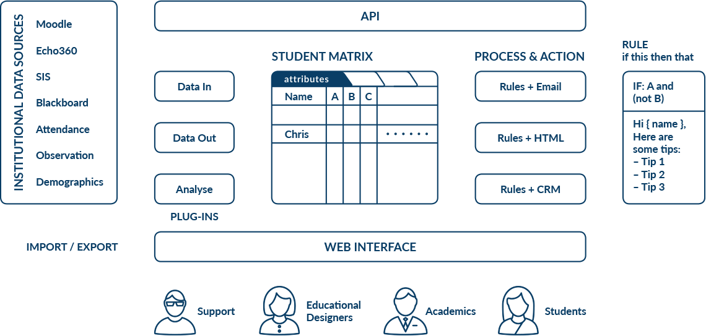

==============
What is OnTask
==============

Welcome to OnTask, the platform offering instructors and educational designers
the capacity to use data to personalise the learners experience.

Learning is complex, highly situated, and requires interacting with peers,
instructors, resources, platforms, etc. This complexity can be alleviated
providing learners with the right support actions. But this process becomes
increasingly complex when the number of learners grows. The more learners,
the more difficult is for instructors to provide support and usual
solutions usually include generic resources that are only relevant to a subset
of the audience.

.. sidebar:: Testimonials

   Comments extracted from focus interviews with learners.

   "its not the email itself, but what it represents: the accountability for
   your learning"

   "I think it makes sense as a reflection of the whole semester, oh this is where I struggled with."

In parallel wih this increase in complexity, learning platforms now generate
a wealth of data when activities are mediated by technology. This
data can be collected and used to help instructors and designers provide a
truly personalised experience. Why is this not hapenning in current
platforms? Because the connection between this data and learner support
actions is challenging to implement. This is the focus of OnTask:
provide instructors and designers with a platform to connect data emerging
from learning environments with highly personalised student support actions.

OnTask is a web application that allows instructors and designers to combine
data previously captured and stored in a table with a set of rules to
personalise the content of a web document. That document can then be sent as
an email or made available to each learner. The following picture shows the
high level structure of the platform.

The rest of the document is divided into three blocks. The :ref:`first block
<install>` covers the technical details to download, install and configure
the tool. It requires technological expertise and access to the adequate
computing facilities (a virtual machine, a server, or similar). The main
audience of this part is system administrators and advanced users that want
to use the tool within their institution or for their own use.

The :ref:`second part <using>` explains how to use OnTask in the context of a learning experience, how to load data, manipulate the table and create the personalised actions. The audience for this part is teachers and designers that need to personalise the interactions they have with learners in a platform offering some data sources.

The :ref:`third part <advanced_features>` covers some more advanced functionalities such an application programming interface (API) that allows other platforms to upload data to OnTask.

Research
--------

There are several platforms that implement similar functionality or follow a similar approach (see for example `SRES <http://sres.io>`_. The common thread among them is the positive impact that personalised communication may have when supporting learners. There are a few scientific publications that document the ideas and processes that inspired the creation of OnTask:

- Liu, D. Y.-T., Taylor, C. E., Bridgeman, A. J., Bartimote-Aufflick, K., & Pardo, A. (2016). Empowering instructors through customizable collection and analyses of actionable information Workshop on Learning Analytics for Curriculum and Program Quality Improvement (pp. 3). Edinburgh, UK.

- Liu, D. Y. T., Bartimote-Aufflick, K., Pardo, A., & Bridgeman, A. J. (2017). Data-driven Personalization of Student Learning Support in Higher Education. In A. Peña-Ayala (Ed.), Learning analytics: Fundaments, applications, and trends: A view of the current state of the art: Springer.  doi:10.1007/978-3-319-52977-6_5

- Pardo, A., Jovanović, J., Dawson, S., Gašević, D., & Mirriahi, N. (In press). Using Learning Analytics to Scale the Provision of Personalised Feedback. British Journal of Educational Technology. doi:10.1111/bjet.12592

License
-------

The OnTask software is open source and available under the MIT License.
