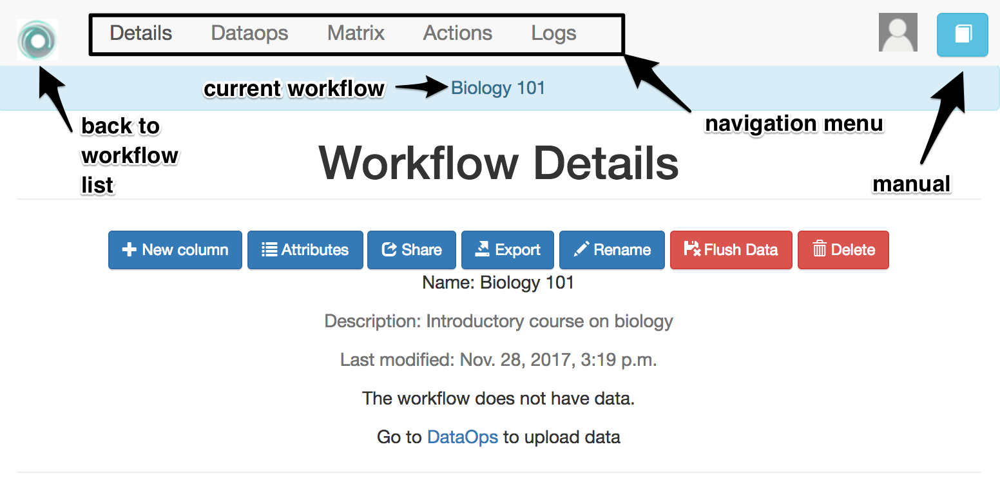
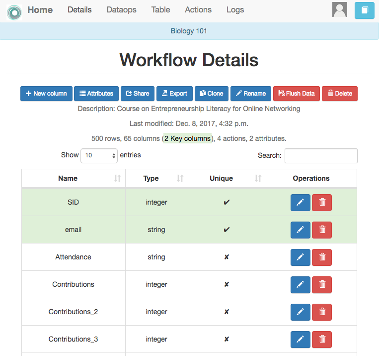
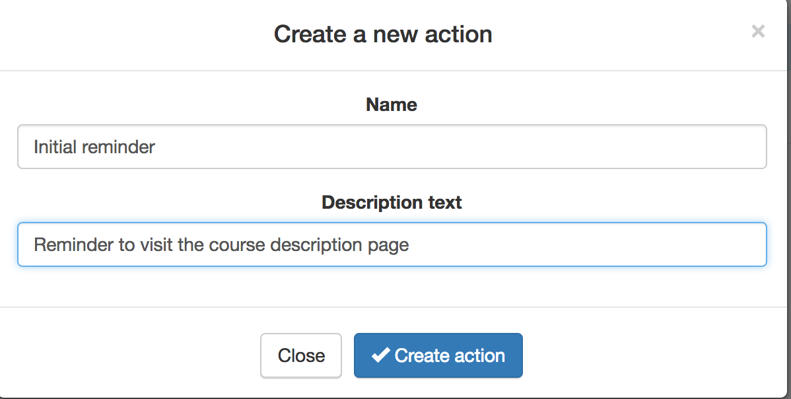
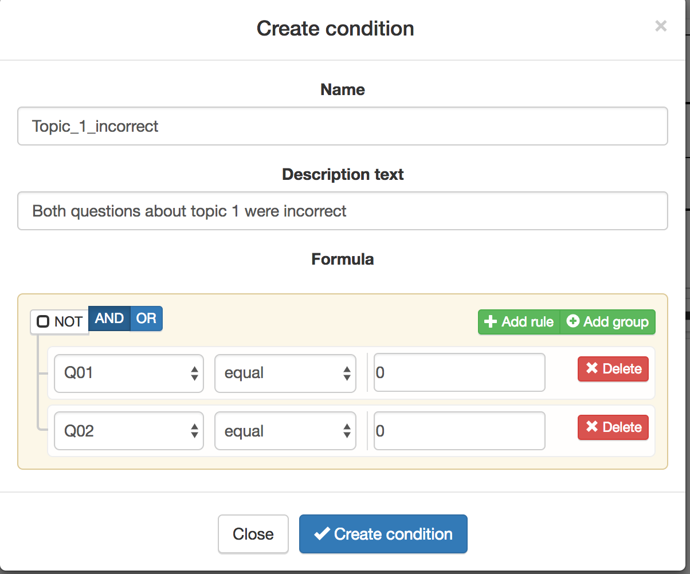
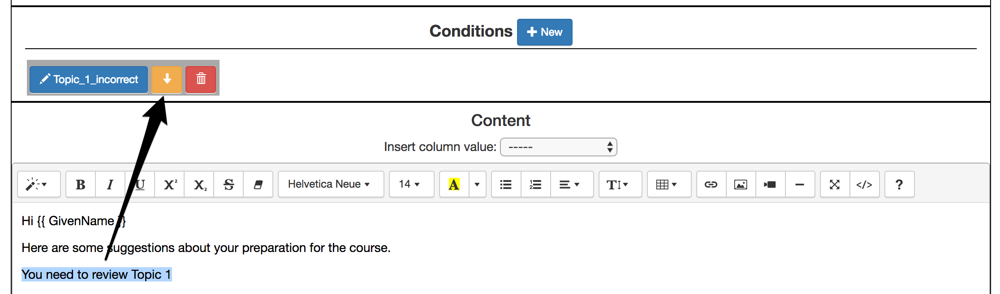

.. _tutorial:

===============
OnTask Tutorial
===============

Before you start the tutorial make sure you have an account in an OnTask instance and you have instructor privileges (create workflows, actions, etc). Also, download the file :download:`learner_information.csv <../Dataset/learner_information.csv>` that contains a synthetic data set with information about learners, participation in a discussion forum, engagement with activities, and some additional features.

Remember the three central concepts in OnTask:

Workflow
  A container with the data (matrix), a set of procedures to manipulate columns, data upload and a set of actions. This container is typically associated with a course, but it could also model an entire institutional degree.

Matrix
  A two-dimensional structure in which each row represents a learner, and each column a learner attribute such as the score in an assessment, class attendance, number of interventions in the discussion forum, engagement with videos, etc.

Actions
  An action is a HTML resource of which certain parts that are included or excluded based on a set of **conditions** created with the learner attributes (for example, number of interventions in the forum is larger than five, and number of times a video was watched is larger than 2).

The following figure represents the high level view of the tool.

.. figure:: drawing.png
   :align: center

The process to create a personalised text is divided into four stages:

Upload the data
  We will use a :download:`CSV file with the learners data <../Dataset/learner_information.csv>`about several activities in a course. In this first stage you will upload the data into a matrix and identify certain special columns (those that provide a unique reference to a learner such as the learner ID)

Review the data matrix
  In this stage you will explore the values in the matrix.

Create an action
  In this stage you will create an action with various conditions that will be applied to the text of a personalised email message.

Review the messages
  And finally you will review the appearance of these messages for different
  learners.

The following steps describe the required operations in each of these stages.

Create a new workflow
---------------------
Log into the tool and click in the tool icon on the top left corner of the screen. If you have an instructor account, you will see the button to create a new workflow as shown in the following figure.

.. figure:: ../Ontask_screens/01_home_create_workflow.png
:align: center

The icon in the top right corner next to your profile image is a link to the OnTask documentation. Click in the button to create a new workflow and enter its name and a description.

.. figure:: ../Ontask_screens/02_new_workflow_name.png
   :align: center

Once you created the workflow the platform shows the list of all the
workflows available.

.. figure:: ../Ontask_screens/02_b_workflow_table.png
   :align: center

The first step is to select or *open* a workflow by clicking on the name to
manipulate it. Once this operation is done, the access to the element is
blocked for any other users (in case the workflow is being shared) to
prevent two users changing the data or the actions simultaneously. The following screens will show the name of the selected workflow at the top. If you want to select another workflow to manipulate, you simply click in the OnTask icon at the top left corner of the screen to go back to the initial table.

Open a workflow
---------------

When you open a workflow, a page with its details is shown like the one in
the following figure

You can see the icon on the top right corner that links to the initial
page, and the icon in the top left corner that links to the documentation.
So far the page only shows the description of the workflow and the last
time it was modified because no data has been uploaded.

The top of the screen now shows the sections offering different operations
over the workflow:

Details
  Is the current page with information about the columns, data types,
  number of actions, etc.

Matrix
  Operations to visualise and manipulate the matrix (search for values,
  add a row, add a column)

Actions
  Operations to create the actions and conditions.

Logs
  A table showing the history of operations performed on this workflow

The buttons immediately under title *Workflow Details* show some of the
operations available at this point:

- :ref:`New column <details_add_column>`

- :ref:`Attributes <details_attributes>`

- :ref:`Share <details_sharing>`

- :ref:`Export <details_export>`

- :ref:`Rename <details_rename>`

- :ref:`Delete <details_rename>`

Data Upload
-----------

We now upload the data included in the file :download:`learner_information.csv <../Dataset/learner_information.csv>`. Click in the *Dataops* menu, and then in the option to *CSV Update/Merge* as shown in the following figure

.. figure:: ../Ontask_screens/05_data_csvupload_initial.png
   :align: center

The next screen asks you to choose a file to upload the data.

.. figure:: ../Ontask_screens/05_b_data_csvupload_initial.png
   :align: center

Choose the file :download:`learner_information.csv <../Dataset/learner_information.csv>` and proceed to the next step. The next screen shows a table with the
name of the detected columns, the type (also automatically detected), a
pre-filled field with the column name (in case you want to change it), and if
 it is a *key column* (there are no repeated values in all the rows).

   .. figure:: ../Ontask_screens/06_data_csvupload_student_list.png
      :align: center

The *key* columns are highlighted because a workflow must have at least one column of this type in its matrix. Select all the column (clicking in the top element labeled *load*) and click on the *Finish* button, and then back to the
*Details* page to see the summary of the information in the workflow.

You can now see the information about the columns present in the workflow as
shown in the follogin figure

For each column you can change its name, description, type and key
attributes, or delete it from the workflow (icons in the left most column of
the table).

Browsing the matrix
-------------------

Once the data has been uploaded, click in the *Matrix* link at the top of the screen. The following screen shows the values stored in the matrix

   .. figure:: ../Ontask_screens/18_matrix_initial.png
      :align: center

There is a search box at the top of the table to browse the content of the
matrix.

   .. figure:: ../Ontask_screens/19_matrix_search_column.png
      :align: center

Workflow Operations
-------------------

There are several operations available at the details page.

Attributes
^^^^^^^^^^

If you click again in the *Details* link at the top of the screen you will
see again the page with the workflow details, but this time it will include
the information about the columns just loaded.

You can define a set of *attributes* in the workflow. This is simply a set of
pairs *name, value* that you can use to have a single place where a value is
defined and then reused in several other locations. For example, the name of
the course is probably going to appear in various communications with the
learners. If you define the attribute *Course_name* with that value, you can
then refer to the attribute and it will be replaced by its value.

.. figure:: ../Ontask_screens/20_matrix_custom_attributes_initial.png
   :align: center
   :width: 50%

Share
^^^^^

You may share a workflow with other instructors in the platform. The *Share*
button will allow you to add/remove other users to this list.

.. figure:: ../Ontask_screens/21_workflow_share.png
   :align: center
   :width: 50%

Remember that whenever you open a workflow, it becomes unavailable for the other users with whom it is being shared.

Export
^^^^^^

This functionality allows you to take all the information included in a
workflow and export it. The functionality offers the option of including in
the export only the data, or the data and the actions.

.. figure:: ../Ontask_screens/22_workflow_export.png
   :align: center
   :width: 50%

Rename
^^^^^^

Use this function to change the name and description of the workflow

Flush Data
^^^^^^^^^^

This function deletes the data associated with the workflow. It maintains the
set of attributes and the actions, but it removes the conditions and filters
from all the actions.

Delete
^^^^^^

This function deletes completely the workflow from the platform.

Actions
-------

Click in the *Actions* link at the top of the screen. The next screen shows
the list of actions that are part of the workflow, and if there is none, you
will only see the button to crate a new one.

.. figure:: ../Ontask_screens/22_rule_initial.png
   :align: center

Click on the button to create a new action and provide a name and a
description.

The next screen is the *action editor*. The functions are divided into three areas. The one at the top allows you to specify a condition to select or filter a subset of students. The second contains the conditions to be used in the personalised text. The third is a HTML text editor with the content to personalise.

.. figure:: ../Ontask_screens/24_action_edit.png
   :align: center

Place the cursor in the text area and start the text with a salutation, then select the name of a column from the pull-down menu right above the text editor and select the column *GivenName*. The string ``{{ GivenName}} `` appears in the text area. This notation is to instruct the next steps to replace the value among double curly braces with the name of each student.

Click now in the button *New* in the condition area. A form appears to
introduce the name, description and formula. The formula may contain any
combination of Boolean operators with respect to the column values. For
example, the condition::

  Q01 is equal to 0 AND Q02 is equal to 0

can be encoded in the formula widget as shown in the following figure

We can now use this condition to control the appearance of text in the text
area. Write a sentence that you would like to appear, select it and then
click in the arrow button in the condition.

The text area is then surrounded by two marks::

  You need to review Topic 1

This is the encoding to instruct the processing step to check the value of
the condition ``Topic_1_incorrect`` and include the surrounded text only if
the condition is true.

You may also insert any attributes attached to the workflow. The attribute
name will be replaced by its value when processing the text.

You can add additional conditions and use them to control the appearance of
additional blocks of text.

.. figure:: ../Ontask_screens/27_action_condition_complex.png
   :align: center

