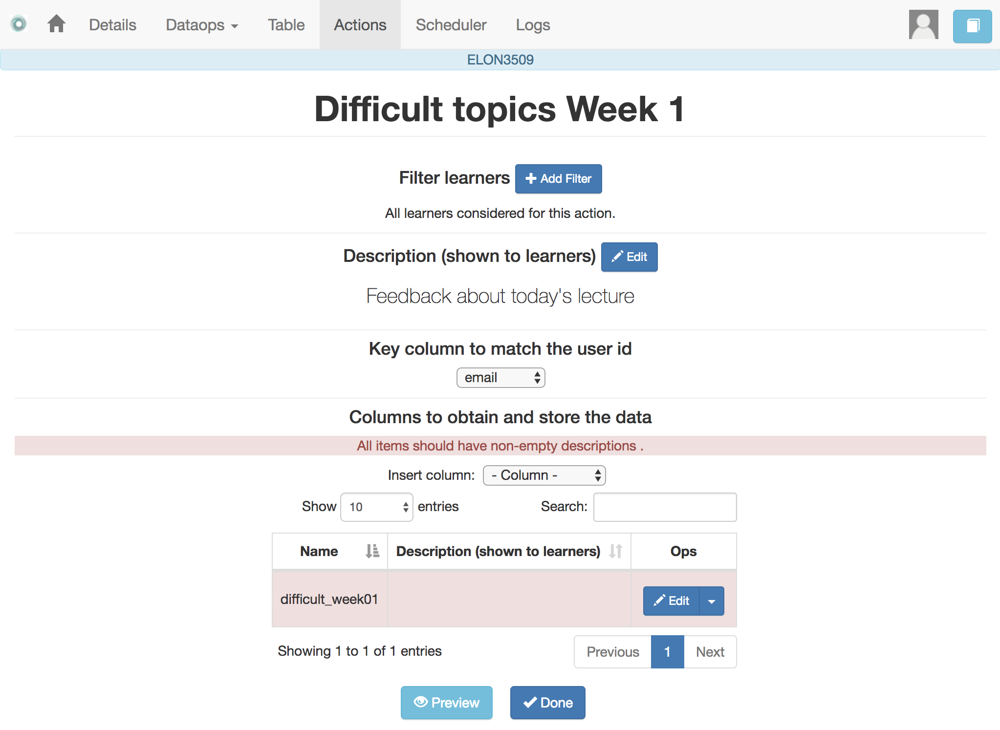
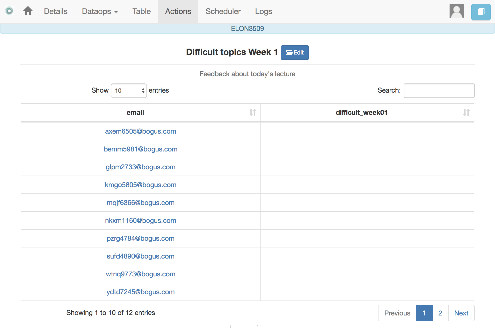
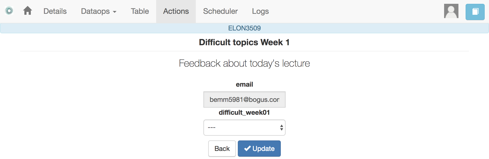
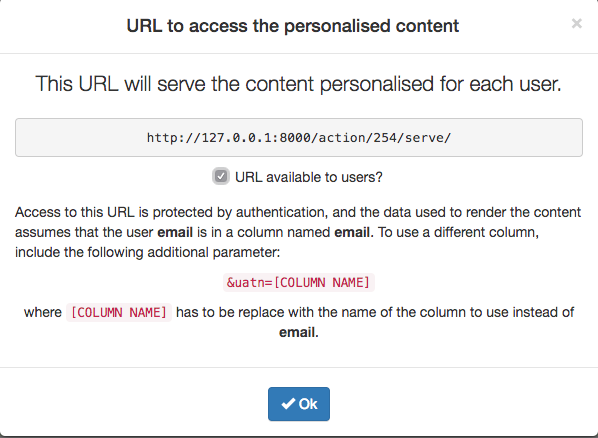
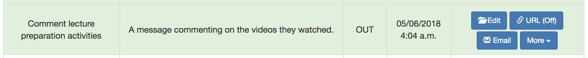
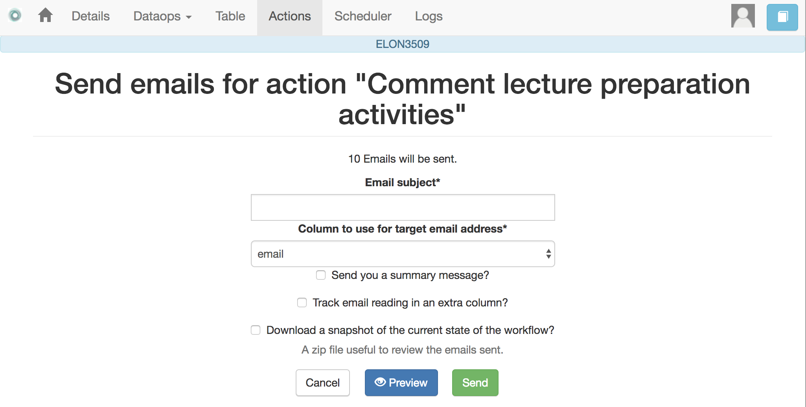
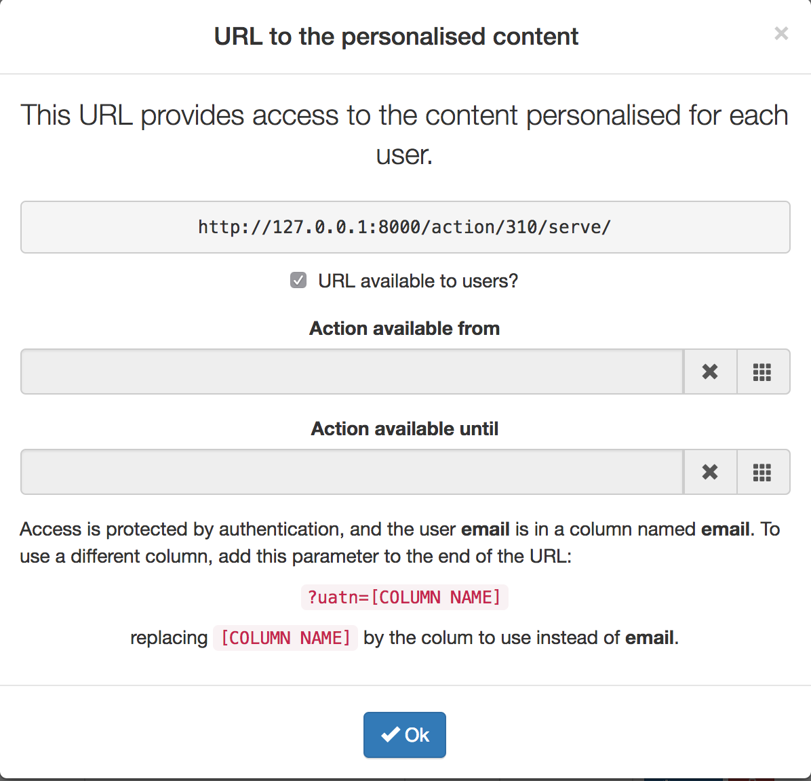

.. _action:

The Actions
===========

    "In order to carry a positive action we must develop here a positive
    vision"
    -- Dalai Lama

This is the most important functionality of the platform. Actions are exchange
of information with the learners. There are two types: actions in, and actions
out. A workflow contains an arbitrary number of these actions. The *action*
page shows a table with the actions in the selected workflow.

.. figure:: images/Ontask____Actions.png
   :align: center
   :width: 100%

Similarly to the case of the workflow, each action is identified by a name
(unique) and an optional description. There are several operations supported
for each action (right most column in the table shown in the previous figure).

Actions In
----------

These actions allow you either instructors or students to introduce
information in the table stored in a workflow. When providing information, you
typically are interested in a subset of the rows (some of the learners) and a
subset of the columns (some of the factors). For example, you would like to
check if a group of students is attending one face-to-face session, or if a
group of students is engaging in a project discussion.

These actions are edited using the screen shown in the following figure:

The page has two elements. The first one is a filter to restrict the rows in
the table considered for data entry. You create a condition, and those rows
that satisfy it are then prepared for data entry. The second part of the
screen is to select those columns that you want to include in the data entry
form. You must select at least a *Unique* column (shown with green background)
and a non-unique column.

Once an *Action In* has been selected, there are two operations available
represented by the buttons with labels *Run* and *URL*. The *Run* operation is
intended for the instructors to enter the data for a set of learners. After
clicking the link the platform shows a table with the data about the learners.
The table has a search box in the upper left corner to quickly find a person
as illustrated in the next figure.

An instructor may click in the link available in the right column and it is
offered the possibility of modifying the information in the pre-selected
columns for that learner.

After entering the information the platform refreshes the list of students for
which the data entry is still allowed. The second operation available for
*Actions In* is to make available the URL to learners so that they
individually enter the information themselves. If you go back to the table
showing all the actions and click in the icon with label *URL* you are given
the choice to enable/disable a specific URL for the students to access the
data entry screen.

You then may send or make available this URL and, after authentication,
students will be able to enter the information requested and the values are
automatically stored in the right row and column in the table. These actions
offer an ideal procedure to collect information about any aspect of a course
in a way that is centralized and available for further processing. The power
of these actions is complemented when combined with *Actions Out*, in which
personalized content is made available to the learners.

Actions Out
-----------

These actions allow to create a resource (in a format
close to HTML) and mark certain elements with conditions that will control its
appearance in the final view. Think of these *actions out* as a resource
(item, message, tip, comment) you would give learners during a experience. You
may have several of these items prepared to be used at different points during
the experience. The action is manipulated with the screen shown in the
following figure

.. figure:: images/Ontask____Edit_action1.png
   :align: center
   :width: 100%

Before describing in detail the structure of this screen let's digress for a
second and explore the concept of *condition*. A condition in OnTask is  a
Boolean expression, or if you prefer, an expression that when evaluated will
return either **True** or **False**. These expressions are commonly used in
other applications such as spreadsheets or programming languages. The
following image shows an example of this condition.

The Boolean expression is contained under the title **Formula**. The
expression can be alternatively read as::

  Days_online_2 = 0

The first element of the expression is the variable ``Days_online_2``. The
second element is the equal sign, and the third component is the constant
zero. The variable ``Days_online_2`` may be replaced by any value in a
procedure we call *evaluation*. So, if the expression is evaluated replacing
the variable by the value 3, it results in :math:`3 = 0` which is false.
Alternatively, if we evaluate the expression replacing ``Days_online_2`` with
the value 0, then the expression becomes :math:`0 = 0`, which is trivially
true. With this structure, any expression then is evaluated by replacing the
variables by values and deciding if the resulting expression is true or false.

These conditions can have nested sub-expressions and get complex fairly quickly.

However, the underlying mechanism to evaluate them remains the same: replace
variables with values and decide the result (true or false). OnTask relies on
these expressions to personalise the content of the actions.

Let's now go back to the screen to edit an action. The area has four components

The filter
  The top area contains a *filter*. This element is an expression used to
  decide which table rows will be selected and used with this condition.

  .. figure:: images/Ontask____Edit_action_filterpart.png
     :align: center
     :width: 100%

  The line below the button to edit the expression states how many table
  rows satisfy the filter condition (and therefore are selected). In
  practice, this is as if you dropped from the table some of the rows (it is
  just that they are ignored, not dropped.

The conditions
  This is the area immediately below the filter. Each condition allows you to
  edit its expression (first block with the pencil), use it in the text
  blow (block with the arrow), or delete it (trash can icon) as shown in the
  figure below

  .. figure:: images/Ontask____Edit_action_conditionpart2.png
     :align: center
     :width: 100%

The HTML text
  This is the area to create the personalised document. It is a conventional
  HTML editor offering the usual functionalities (inserting text in
  various forms, headings, lists, links, images, etc.) Right above the editor
  window you have two choice menus that you can use to insert either a
  :ref:`workflow attribute <details_attributes>` or a column name that will
  be replaced by the corresponding value for each row.

  .. figure:: images/Ontask____Edit_action_textpart.png
     :align: center
     :width: 100%

The preview/save buttons
  The *Save* button saves the content of the text editor, the *Save & Close*
  saves the content of the text editor and returns to the list of actions,
  and the *Preview* button shows how the text is rendered for every row in
  the table.

Using column values, attributes and conditions in an Action Out
^^^^^^^^^^^^^^^^^^^^^^^^^^^^^^^^^^^^^^^^^^^^^^^^^^^^^^^^^^^^^^^

The purpose of this page is to allow you to create a text in the editor that
may include three types of elements that are personalised for each row: an
attribute name, a column name or a condition.

To insert an attribute name simply place the cursor in the text editor in the
location where you want the value of that attribute to appear. Then, select
the attribute from the area above the editor and you will see how the name
of the attribute surrounded by double curly braces appears in the text (for
example ``{{ course_name }}``. Only :ref:`the attributes <details_attributes>`
you previously created in the details page are available.

To insert a column name, you follow the same steps but this time you select
one of the elements next to the text *Insert column value*. Place the cursor
in the location in which you want that value to appear, select the column
name from the pull-down menu, and the name appears in the text surrounded by
double curly braces (for example ``Hi {{ GivenName }}``.

These two elements will be included in the text with the corresponding values
(the same for all rows in the case of the attribute, and the value of the
corresponding row in the case of the column name. Inserting a condition is
different. Highlight the text in the editor and then click in the arrow of
one of the conditions. The text will be surrounded by two marks. For example
if the condition name is ``Video_active``, the text in the editor will appear
as:

  Good work with this week's video

This format states that the message *Good work with this week's video* should
appear only if the condition ``Video_active`` is true. If not, the text
should be ignored. The following figure illustrates this process.

  .. figure:: images/Ontask____howtocreatetext.gif
     :align: center
     :width: 100%

Previewing the content of an Action Out
^^^^^^^^^^^^^^^^^^^^^^^^^^^^^^^^^^^^^^^

Once a text is created, you need to verify that all the elements are properly
visualised for each of the rows. This is the purpose of the ``Preview``
button at the bottom of the page.

  .. figure:: images/Ontask____howtopreviewtext.gif
     :align: center
     :width: 100%

Sending personalised emails
^^^^^^^^^^^^^^^^^^^^^^^^^^^

You now have created an action and verified its content using the
*Preview* button. Go back to the *Actions* screen (showing the table with
the actions you created in the workflow). The right-most column shows a
button that reads *Send Email*.

This functionality process the text in the
action for each learner and sends the resulting text as an email. If you
click in that button the platform asks you for additional information:

The subject
  A line to be included as subject of all the emails.

The column with the email address
  OnTask needs to know where to send the email. It assumes that you have a
  column containing that information for each learner and it needs you to
  select that column.

Send summary message
  If you select this option OnTask will send you an email with the summary of
  this operation (number of rows in the table that were selected by the
  filter, number of emails sent, date/time of the operation, etc.

Snapshot of the workflow
  If you select this option, after the emails are sent, the platform returns
  you a file that contains a snapshot (picture) of the workflow. It basically
  freezes the content of the workflow and places it in a file given to you.
  You may take this file and :ref:`import back the workflow <workflow_import>`.
  In this new workflow you can check the values and messages at the time the
  operation was executed.

Making personalised content available to learners
^^^^^^^^^^^^^^^^^^^^^^^^^^^^^^^^^^^^^^^^^^^^^^^^^

Sending a personalised email is just one of various possible actions to do
with a personalised text. Another one is to make the content available
through a URL that can then be given to the learners. OnTask offers this
possibility through the button labelled ``URL`` followed by either the word
``(Off)`` or ``(On)``.

If you select this option, the platform will show you the URL providing
access, the choice of making it available, and the possibility of using an
alternative column containing the email address.

You may enable/disable this URL at any time. If a learner tries to access
this URL and it is disabled, the platform informs the user that the
information is not available.

