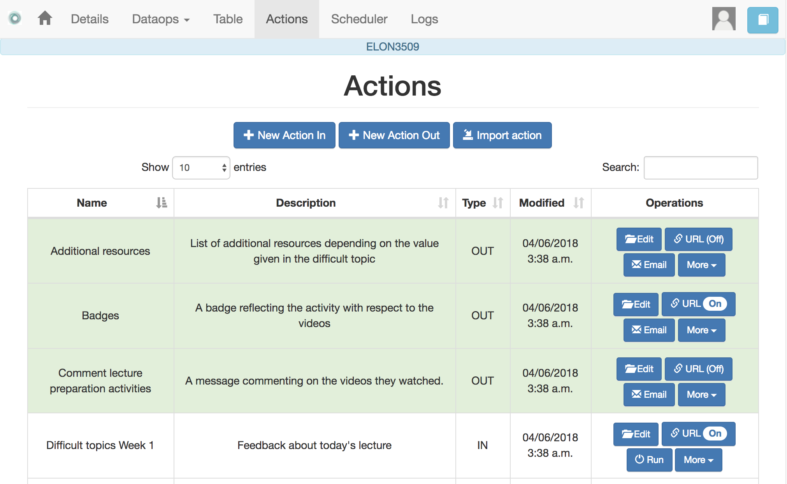

.. _action:

The Actions
-----------

    "In order to carry a positive action we must develop here a positive
    vision"
    -- Dalai Lama

This is perhaps the most important functionality of the platform. It allows edit a resource (in a format close to HTML) and mark certain elements with conditions that will control its appearance in the final view. Think of an *action* as a resource (item, message, tip, comment) you would give learners during a experience. You may have several of these items prepared to be used at different points during the expeience. As a consequence, a workflow may contain an arbitrary number of these actions. The *action* page simply shows a table with the actions contained in the workflow.

Similarly to the case of the workflow, each action is identified by a name (unique) and an optional description. There are also various operations supported for each action (right most column in the table shown in the previous figure). Also, and following the same structure than the workflow, you may open an action to manipulate it by clicking on its name. The action is manipulated with the screen shown in the following figure

Before describing in detail the structure of this screen let's digress for a second and explore the concept of *condition*. A condition in OnTask is basically a Boolean expression (or if you prefer, an expression that when evaluated will return either **True** or **False**. These expressions are commonly used in other applications such as spreadsheets or programming languages. The following image shows an example of this condition.

.. figure:: images/Ontask____Edit_action_filter.png
   :align: center

The Boolean expression is contained under the title **Formula**. The expression can be alternatively read as::

  Days_online_2 = 0

The first element of the expression is the variable ``Days_online_2``. The second element is the equal sign, and the third component is the constant zero. The variable ``Days_online_2`` may be replaced by any value in a procedure we call *evaluation*. So, if the expression is evaluated replacing the variable by the value 3, it results in :math:`3 = 0` which is false. Alternatively, if we evaluate the expression replacing ``Days_online_2`` with the value 0, then the expression becomes :math:`0 = 0`, which is trivally true. With this structure, any expression then is evaluated by replacing the variables by values and deciding if the resulting expression is true or false.

These conditions can have nested sub-expressions and get complex fairly quickly.

.. figure:: images/Ontask____Edit_action_filter2.png
   :align: center

However, the underlying mechanism to evaluate them remains the same: replace variables with values and decide the result (true or false). OnTask relies on these expressions to personalise the content of the actions.

Let's now go back to the screen to edit an action. The area has four components:

The filter
  The top area contains a *filter*. This filter is a condition that states which rows should be selected from the matrix to be used with this condition. In the