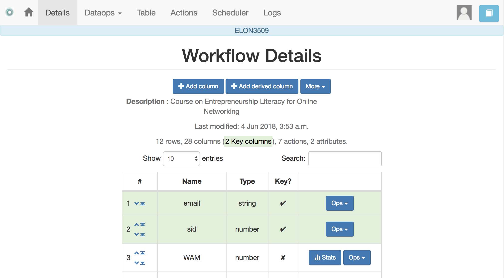
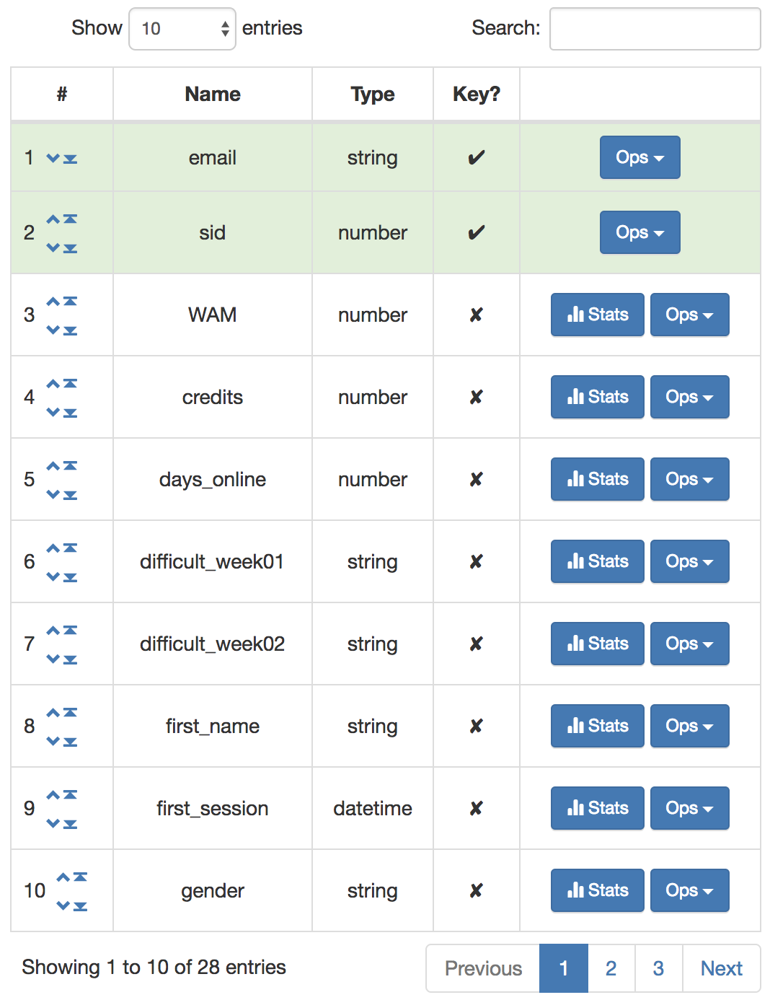

.. _details:

Workflow Details
----------------

    "The details are not the details. They make the design"
    -- Charles Eames

After selecting a workflow to manage, the *details* page appears with a lot of information about operations, structure of the data, information about the columns, etc. The top of the screen contains the information shown in the following figure.

The top of the page now includes links to additional menus with operations to perform over the workflow (some of them will be available depending on your user profile). Under the top bar the application shows the name of the workflow selected for manipulation. Under the title *Workflow Details* there are buttons (available depending on your profile and ownership of the workflow) that offer the following operations:

Add a new column
  Opens a dialog to create a new column in the matrix. It requires the name, type of column, a comma separated list of allowed values (optional) and a value to assign to all cells in the column (optional).

  .. figure:: images/Ontask____add_column.png
     :align: center

.. _details_attributes:

Attributes
  This is simply a dictionary of pairs ``(name, value)`` so that whena ``name`` appears in a personalised text, it is replaced by the ``value``. The main use of these attributes is when a value has to appear in various locations and you may want to change all its occurrences. For example, the instructor name could be included as one of the attributes so that if it changes, modifying the attribute is the only required step.

  .. figure:: images/Ontask____attributes.png
     :align: center

.. _details_sharing:

Share
  A screen to make the workflow accessible to other users. You are supposed to know the user identification (there is no search functionality available).

  .. figure:: images/Ontask____share.png
     :align: center

Export
  This functionality allows you to take a snapshot (or a picture) of the content of the workflow and store it in a file for your records.

  .. figure:: images/Ontask____Export.png
     :align: center

  The menu offers you the possibility of exporting only the data, or the data **and** the :ref:`action <action>` in the workflow.

Rename
  This functionality allows to change either the name or the description of the workflow.

  .. figure:: images/Ontask____updatewflow.png
     :align: center

Flush data
  This operation deletes all the data attached to the workflow, but preserves the workflow structure (that is, the name and the description only).

  .. figure:: images/Ontask____flushdata.png
     :align: center

  Given the destructive nature of this operation the platform requires you to confirm this step.

Delete
  Operation similar to the previous one, but now the whole workflow is deleted and therefore un-selected. If executed, the platform will go back to the list of workflows as this one is no longer available for operations.

  .. figure:: images/Ontask____wflowdelete.png
     :align: center

  As in the previous case, the platform asks for confirmation before carrying out the delete operation.

Under the buttons to carry out these workflow operations the platform shows a summary of the information contained in the workflow.

.. _columns:

The Columns
***********

The data in a workflow is stored in a structure called *a matrix* that is made of rows and colums (similar to a spreadsheet). The information about the columns is included in a table in the workflow details page.

Each column as a name (has to start with a character and can only have `_`, letters and numbers), a type (one of integer, string, double, boolean or datatime), a field stating if the values of that column are uniques for the rows, and two operations. When a column is marked as *Unique*, it means that all the values it contains are different and unique for each row. Think of a column containing a passport number. Such number is different for every person. There could be several columns with this property. The application detects automatically this property in a column. You may edit and change this properly as long as the values are the adequate ones (they satisfy the uniqueness property if you try mark a column as unique. The operations avaiable over columns are:

Edit
  It allows you to change the name, type, unique and values allowed in the column. If you are changing the column type, the application will check if the existing values are valid. If not, the change will not be allowed. Similarly, if the *Unique* property is selected, the application checks the values to make sure this property is satisfied.

  .. figure:: images/Ontask____columnedit.png
     :align: center

  As you can see in this example, the matrix has an unusually large number of columns. The search box at the top of the table allows you to search the column names and types.