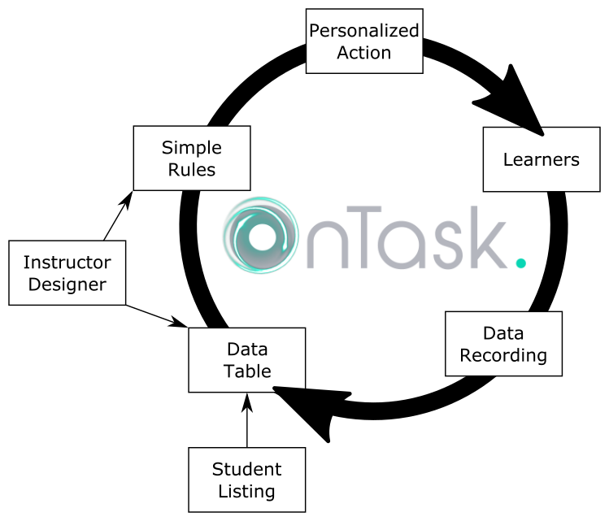

.. _using:

============
Using OnTask
============

In a nutshell, the idea of OnTask is to help instructors and designers to
use data available about a what is happening in a learning experience to
design and deploy personalised learner support actions. This last term,
*personalised support actions* is purposefully vague to include any action
that is given to learners in different form depending on some personal
conditions. The following figures illustrates an example of how OnTask can
help instructors and learners.

Imagine a learning experience in which you want to provide personalised
messages to the learners in three instances. In the first week, you want to
send a welcome message and change slightly the text based on the type of
background. The second week you want to send some comments and suggestions
about the participation in the forum but the text will depend on the measures
of engagement obtained from the platform. Finally, you want to send a third
personalised message depending on the level of engagement with the videos in
the course. The main idea of these messages is that you want to change some
portions based on the information available in the matrix.

The main entity in the platform is called a :ref:`*workflow* <workflow>` and
represents a set of data capturing procedures, a matrix with current data,
and a set of actions. The usual steps require first to populate the matrix
with data extracted from the learning environment. In the figure we assume
three data sources: the class list (basic information about the learners),
data about participation in an online discussion forum, and data about
resource usage.

These three sources are combined and stored in the second entity in OnTask:
the matrix. Think of the matrix as a conventional excel sheet storing the
information about the learners (one learner per row and a set of features
about each learner as columns).

The third entity in OnTask is the *action* that is basically a text with
elements that can be changed and adapted to each learner depending on the
values of the features included in the matrix. This text can be included in
an email, made available through a web page, or forwarded to another system
for further processing.

A workflow in OnTask contains a single matrix and a set of actions. This
container is conceived to manage the data and actions related to a learning
experience.

The following sections offer a more in-depth description of all these elements
as well as examples with real scenarios.

.. toctree::
   :maxdepth: 2
   :caption: More detail information about the following elements:

   workflow
   details
   dataops
   matrix
   actions
   logs
