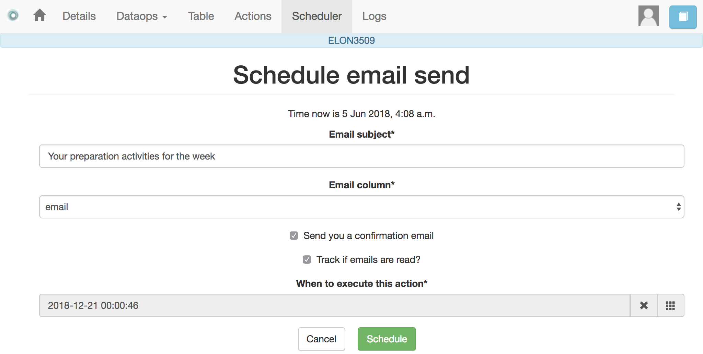
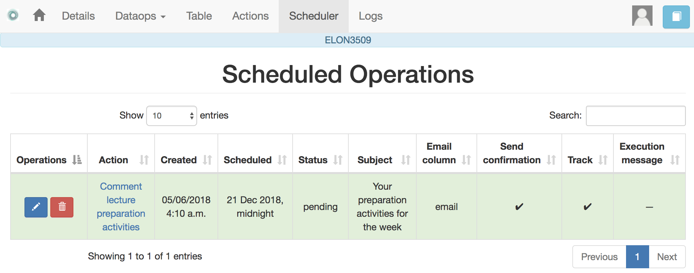

.. _scheduler:

The Scheduler
=============

   "I have no regular schedule. I get up whenever I can."
   -- Jimmy Wales

The *actions out* that are used to send emails can be *scheduled* to
execute at some point in the future. The *Schedule* operation in these
actions opens a dialogue like the one shown in the following figure:

The action (sending the emails with the personalised text) is executed at the
selected time. This functionality requires the server to be configured to
check the list of pending tasks and execute them at the appropriate time (see
:ref:`scheduling_tasks`)

The *Schedule* item in the navigation menu shows all the scheduled tasks for
the current workflow. The left-most column offers the operations to edit the
task or delete it.

