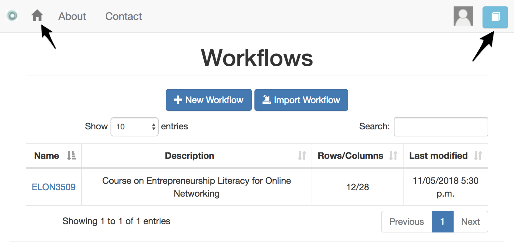

.. _workflow:

The Workflow
------------

    "But anyone who has experienced flow knows that the deep enjoyment it
    provides requires an equal degree of disciplined concentration."
    -― Mihaly Csikszentmihalyi

The workflow in OnTask is simply a container that brings together the matrix,
the operations to upload the data, and the actions to create the
personalised content. The initial screen in OnTask shows you the available
workflows as shown in the following figure.

The screen shows three operations: creating a new workflow (providing only
name and description), importing a workflow previously exported from the
platform, or simply open a workflow to work with it. You may use the same
workflow as shown in the figure importing  the :download:`ELON3509 workflow <../../initial_workflow.gz>`.

