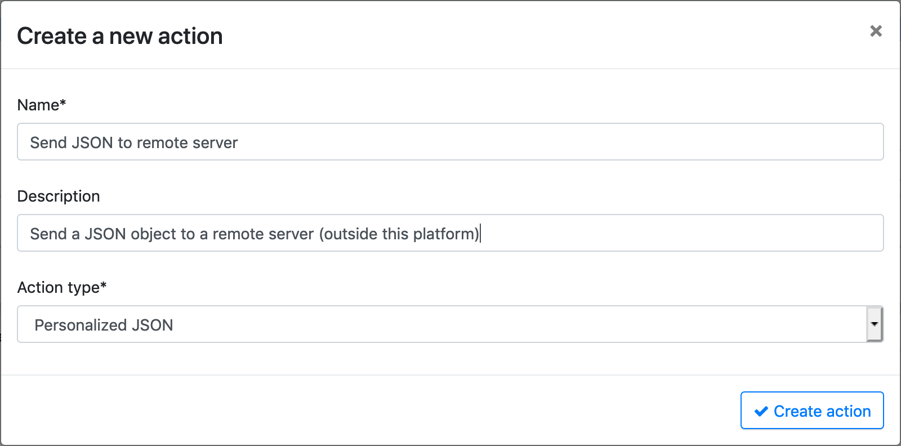
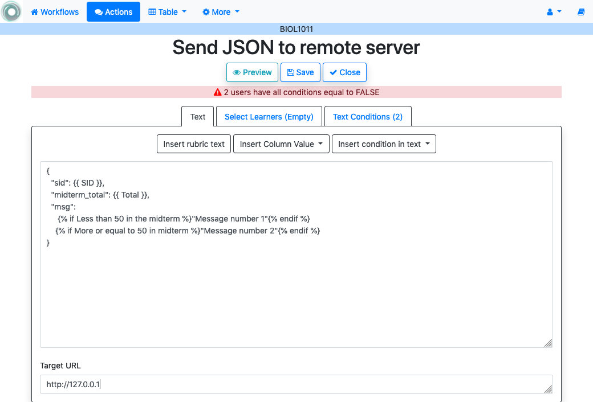
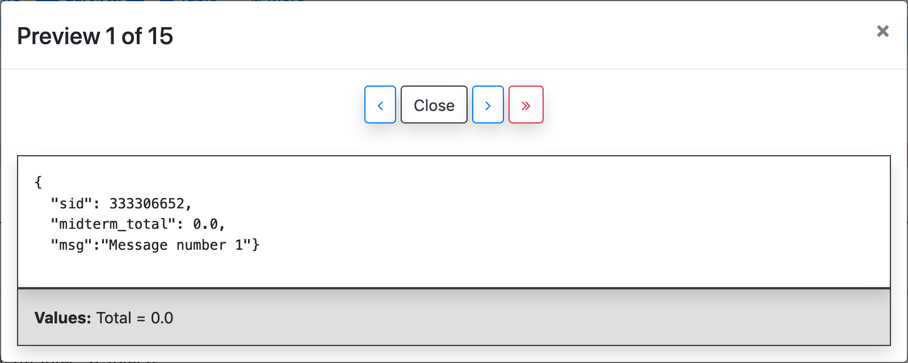

.. _tut_actions:

Actions
=======

Log into OnTask and open a workflow. Access the *Actions* page clicking in the link with the same name in the top of the screen. The next screen shows the list of actions that are part of the workflow, and the buttons to create a new one, import, or manage the data table.

.. figure:: ../../scaptures/tutorial_action_index.png
   :align: center

OnTask contains functions to manage three type of actions: personalized text, personalized JSON object, and surveys.

.. _tut_personalized_text_action:

Personalized text action
------------------------

Click on the button to create a *New Action*, provide a name, a description (optional) and select the type *Personalized text*.

.. figure:: ../../scaptures/tutorial_personalized_text_create.png
   :align: center

The next screen is the *personalized text action editor*. The functions in this page are divided into three areas.

.. figure:: ../../scaptures/tutorial_personalized_text_editor.png
   :align: center

1. This section allows to define a *filter*, or a condition to select a subset of the learners for which this action will be considered.

2. This section contains the conditions to be used in the personalized text.

3. This area is the HTML text editor to write the content to personalize.

Place the cursor in the text area and start the text with a salutation. Then click in the pull down menu next to *Insert* with the value *Column name*. Select the column *GivenName*. The string `{{ GivenName}}` appears in the text area. This notation is to instruct the next steps to replace the value among double curly braces with the name of each student.

.. figure:: ../../scaptures/tutorial_personalized_text_editor_with_column.png
   :align: center

Click now in the button *New* in the condition area. A form appears to introduce the name, description and formula. The formula may contain any combination of Boolean operators with respect to the column values. For example, the condition::

  Program equal to FASS

can be encoded in the formula widget as shown in the following figure

.. figure:: ../../scaptures/tutorial_condition_program_FASS.png
   :align: center

We now use this condition to control the appearance of text in the editor.

- Write a sentence in the editor below the greeting.

- Select it

- Click in the arrow button next to the condition name and select *Insert in text*.

.. figure:: ../../scaptures/tutorial_personalized_text_condition_inserted.png
   :align: center

The text area is then surrounded by two marks::

  Here are some suggestions for FASS

This is the format to instruct the processing step to check the value of the condition ``Program is FASS`` and include the surrounded text only if the condition is true.

Repeat the procedure and create three more conditions such that they are true if the value of the *Program* columns is equal to *FSCI*, *FEIT*, and *SMED* respectively. Insert three more messages in the text area that are controled by their respective conditions. At the end, each sentence will be surrounded by text referring to each of the four conditions you created:

.. figure:: ../../scaptures/tutorial_personalized_text_condition_inserted2.png
   :align: center

.. _tut_action_filter_definition:

Selecting only a subset of learners
^^^^^^^^^^^^^^^^^^^^^^^^^^^^^^^^^^^

In some cases, you may want to create a personalized text only for a subset of the learners. This can be done defining a *Filter* at the top of the screen (area 1). For example, the following filter:

.. figure:: ../../scaptures/tutorial_personalized_text_filter.png
   :align: center

selects only those learners for which the column *Attendance* in the table has the value *Full Time*. Upon closing the small window with the filter data, the editor screen contains information about how many learners are being selected by that filter.

.. figure:: ../../scaptures/tutorial_personalized_text_editor2.png
   :align: center

The application will show a message if the filter excludes all the learners (none of them satisfy the condition given in the filter).

The text in the editor will be processed for each row in the table (or the subset specified by the filter) and all conditions and fields will be evaluated with the values in that row. In other words, if a sentence is surrounded by one condition, the condition is evaluated replacing the column names by the values in the row. If the condition is *True*, the text will appear, and if not, it will be ignored.

The botton with name *Preview* at the bottom of the editor allows you to see the text resulting from the evaluation of each row.

.. figure:: ../../scaptures/tutorial_personalized_text_preview.png
   :align: center

The bottom part of the screen shows the values of those columns that were used to evaluate the conditions required in the text. You may use the arrows at the top of the screen to review the message and see how it is changing from learner to learner.

.. _tut_personalized_json_action:

Personalized JSON action
------------------------

The second type of action available in OnTask is called *personalized JSON*. Create a new action and select this type from the pull-down menu when introducing the name and description.

The following screen contains the editor for these actions.

The content is divided into three areas (similar to the ones used to edit :ref:`personalized text actions<tut_personalized_text_action>`.

1. This section allows to define a *filter*, or a condition to select a subset of the learners for which this action will be considered.

2. This section contains the conditions to be used to conform the personalized JSON object. Two conditions have been defined in the example. The first one with name ``Less than 50 in the midterm`` is exactly stating that condition, those students for which the score in the midterm has been less than 50. The second condition is the complementary, those students for which the midterm score has been greater or equal than 50. These conditions are used in the definition of the object in the screen area below.

3. This area is JSON object editor. In the previous figure you see an example of an object that contains three string/value pairs. The first two values are extracted from columns ``SID`` and ``Total`` respectively. The last field with name ``msg`` is defined using the conditions created in the second areaw of this screen.

The *Target URL* field captures the URL to use to send these JSON objects. The action will not be executed unless there is a non-empty value in this field.

As in the case of the :ref:`personalized text actions<tut_personalized_text_action>`, the *Preview* button at the bottom of the screen allows you to preview the resulting JSON objects for the selected rows of the data table.

Surveys and/or Polls
--------------------

Personalized texts can be very powerful to offer students content, comments,
or point them to resources selected based on the available data. This data
may come from sources such as student information systems or the learning
management system. However, in some cases we would like to obtain data either
directly from the students, or perhaps from the instructors through
observation. This functionality is offered in OnTask through the actions
called *Surveys*. These surveys collect information from the students (or the
instructors) through conventional web forms and the data is automatically
added to the workflow table and available to be explored through the
dashboard or statistics.

The first step to create a survey is to go to the *Actions* page, click in
the *New action* button, provide a name, a description (optional) and select
the action type *Survey*:

.. figure:: ../../scaptures/tutorial_survey_create.png
   :align: center

After the survey is created, the following screen is shown

.. figure:: ../../scaptures/tutorial_survey_editor.png
   :align: center

The editor is divided into five areas:

Filter learners
  An expression identical to the one used in the personalized text to select a
  subset of the learners for which the will be available.

Description
  Text describing the survey that is shown to the learners.

Key column to identify learners
  The key column in the table that will be used to identify the users when
  submitting their answers. This is typically the column that contains the
  user email.

Shuffle questions
  If selected, the questions in the survey will be shuffled when shown to the
  learners.

Columns to obtain and store the data
  The columns used to collect the data. In this action, a column is
  equivalent to a question. The description of the column is the text of the
  question. In this part of the editor you may either use one of the
  existing columns as question, create a new column (or
  question), or create a new derived one (the initial values are created by
  combining values from other columns).

This page will show you a warning message if any of the columns used in the
survey has an empty description. Let's suppose you want to ask the learners
two questions:

- What was the most challenging topic for you this week? 

- What was your dedication to the course this week?

To make the data suitable for further processing, we will create the two
questions/columns with a set of pre-defined answers. Use the *Add new column*
button to create two columns of type string and provide the allowed answer
values as a comma-separated list.

.. figure:: ../../scaptures/tutorial_survey_column_creation.png
   :align: center

After creating the column, insert it in the survey by selecting it with the
pull down menu. Repeat the procedure for the second question/column. You can
now add these columns to the action and the editor will show them in the
table at the bottom as shown in the following figure:

.. figure:: ../../scaptures/tutorial_survey_editor2.png
   :align: center

As in the case of the personalized text action, the *Preview* button allows
you to verify how will the learners see the content:

.. figure:: ../../scaptures/tutorial_survey_preview.png
   :align: center

Once created, you may select the URL from the action as it was described for
the personalized text and make it available for learners to enter their
answers. The data will be automatically added to the table.

The *Run* button in the survey actions allows an instructor to introduce the
survey answers for multiple learners. This functionality is used for
instructors to enter observations when interacting with learners. The table
search functionality allows to find the learners quickly and then click in
their survey execution and enter the data.

Combining personalized text and surveys
---------------------------------------

The information collected through surveys is stored in the appropriate columns in the data table and therefore can be used in a personalized text action to select the appropriate message. For example, the information collected as answers to the question *What was the most challenging topic for you this week?* can be used to select a set of apropriate links to resources about the given topic.

