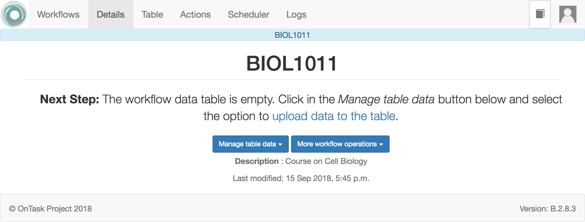

.. _open_workflow:

Open a workflow
===============

OnTask assumes that you will be working with one workflow. The first screen (the one that appears when you log in or when you click in the *Workflows* link in the top menu) shows you the workflows available. To start working with one of them you have to *Open* it.

While the workflow is open, the top menu contains the following links:

Details
  This iss the current page that shows information about the columns, data types, number of actions, etc. contained in the workflow (empty now because we haven't populated it)

Table
  Operations to visualize and manipulate the table (search for values, add a row, add a column)

Actions
  Create, edit and execute actions.

Logs
  A table showing the history of operations performed on this workflow

After you open a workflow, the next page shows its details and information about the columns in its data table. If the workflow does not contain any data, the page only shows basic details as shown in the following figure.

In the current *Details* page, immediately under the title there are two buttons to perform the following operations:

- Manage table data

  - :ref:`Upload or merge data to the table <data_upload>`

  - :ref:`Run a plugin to transform the data in the table <plugin_run>`

- Workflow operations:

  - :ref:`Edit the attributes <details_attributes>`

  - :ref:`Export the workflow <details_export>`

  - :ref:`Rename or change the workflow description <details_rename>`

  - :ref:`Share the workflow with other users in the platform <details_sharing>`

  - :ref:`Clone the workflow <details_clone>`

  - :ref:`Flush the data in the table <details_flush_data>`

  - :ref:`Delete the workflow <details_delete>`

