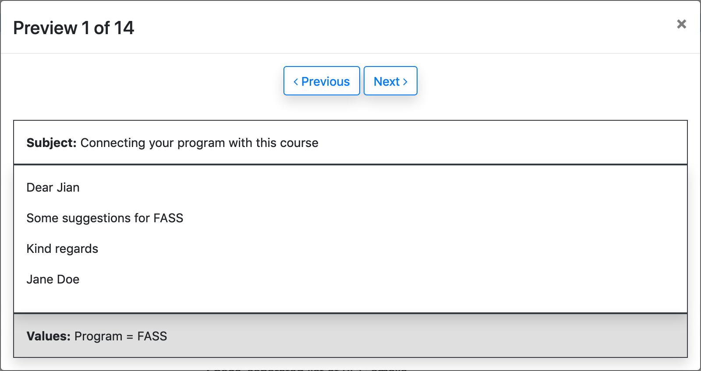
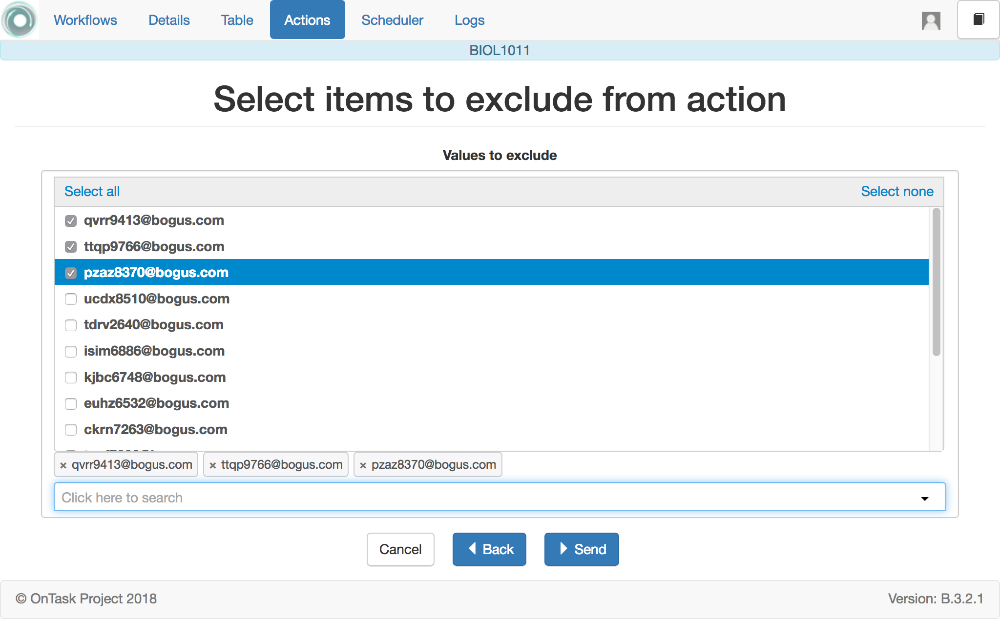

.. _tut_send_personalized_email:

Sending Personalized Text through Email
=======================================

Log into the platform, open a workflow that has data and actions already defined and click the *Action* link in the top menu.

After creating a personalized text action, you may want to send emails to the learners (or a subset of them if you :ref:`defined a filter<tut_action_filter_definition>` in the action). Click in the button with name *Email* in the operations of the personalized text action. The following form appears in the screen:

.. figure:: ../../scaptures/action_personalized_text_email.png
   :align: center

The form allows you to specify the following fields:

Email subject
  String to use as subject for all the emails.

Column to use as email address
  This is the name of the column in the table from where to extract the email
  address to use in the *To* field of the email.

Comma separated list of CC emails
  This is useful when you want to send the emails with copy to other users. The CC emails must be separated by commas (e.g. *user1@bogus.com, user2@bogus.com*)

Comma separated list of BCC emails
  Field analogous to the previous one except that the values are used in the blind copy of the email.

Send you a summary message?
  If selected the platform will send you (the email you used to log in) a message with a summary of the operation once all emails are sent.

Track email reading in an extra column?
  If selected the platform will insert an extra column in the table containing the number of times each email has been opened (this counter, though, may not have a correct value as it depends on the configuration of external programs)

Download a snapshop of the worfklow
  When selected, the platform saves the workflow in its current state. This function is useful to keep an exact replica of the state of the actions, conditions and data when the data was sent. The resulting file can then be imported (see the *Import workflow* in the home page) to check the content of the emails.

Check/exclude email addresses before sending
  If selected the platform will offer you a last chance to specify some email addresses to *exclude* from the emails. This may be useful if you want to remove a small amount of addresses that you know they should not be considered but they cannot be easily removed with the use of the action filter.

Introduce a string in the subject field and click in the button *Preview* at the bottom of the page.

The new page shows the final appearance of the message with its subject and the values for those columns used to configure the text. Click in the arrows next to the *Close* button to traverse the various messages and verify that they are properly composed.

.. _tut_exclude_action_items:

Final look before pushing the GO button
---------------------------------------

When running an action sometimes you may want to verify that the list of rows to be processed is correct, or perhaps in the last step remove one or two rows that you know should not be included (and you didn't filter with the action filter). If you want to go through this extra step *before* running the action, tick the field to *Check/exclude* thesse items. Click in the *Next* button. In the following page you can review the list of items and mark those you want to exclude.

