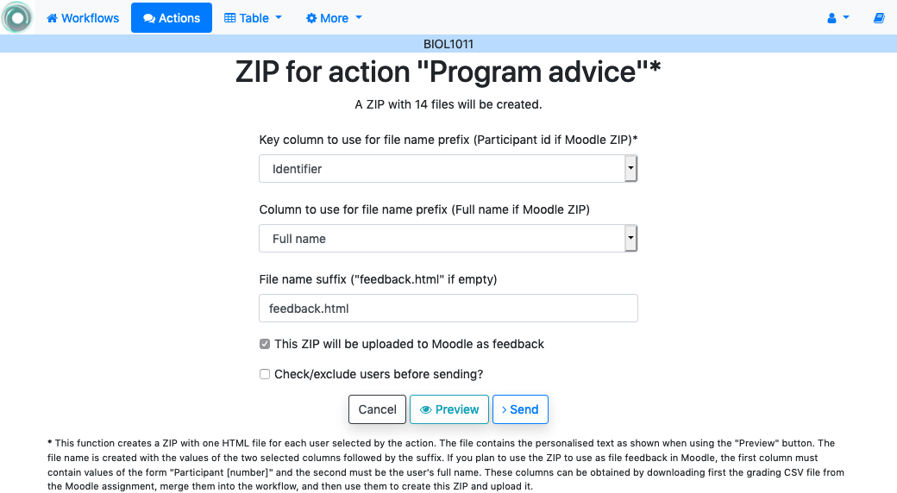
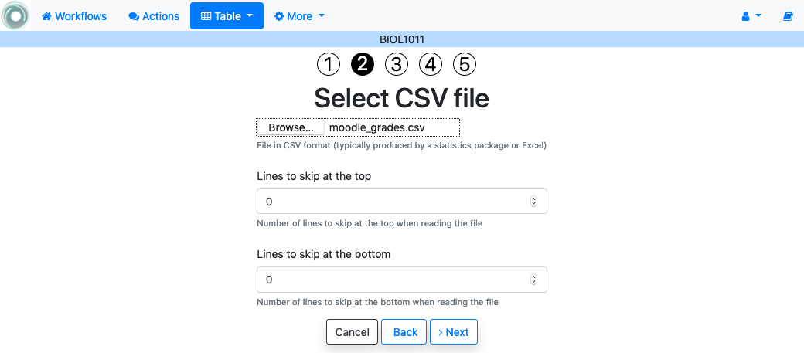
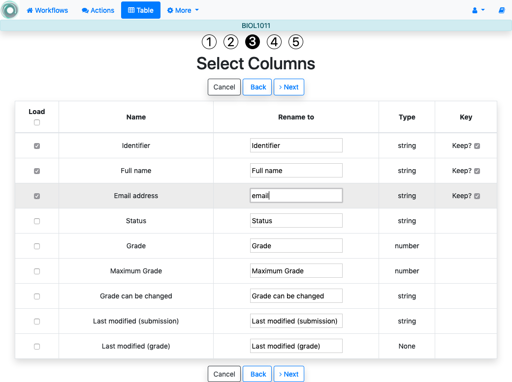
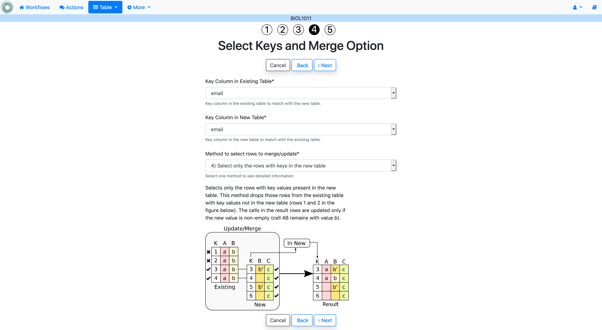
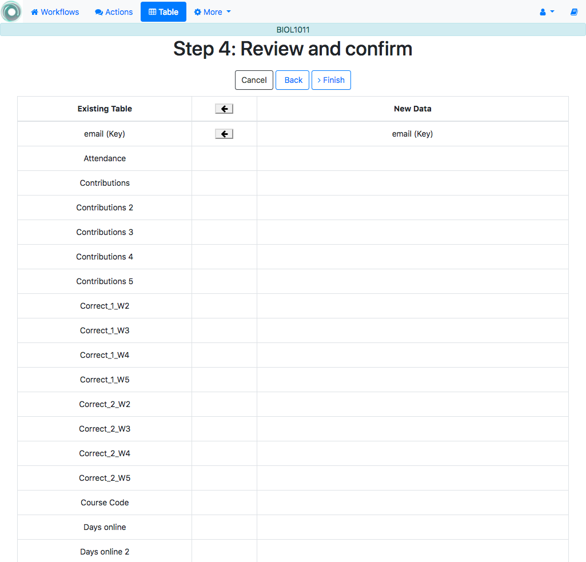

.. _tut_download_zip:

Download a ZIP (and upload it in Moodle)
========================================

Log into the platform, open a workflow that contains data and a personalized action, click in the *Actions* link in the top menu.

The :ref:`personalized text actions<tut_personalized_text_action>` allow you to define a text with parts that are included/excluded depending on the value of the conditions. OnTask then allows you to :ref:`send those texts as individual emails<tut_send_personalized_email>`. However, you may want to extract those texts in HTML and process them with a different platform (for example Moodle). You can do this clicking in the *Zip* button shown in the *Operations* column for some of the actions.

Click in this button for any of the personalized text action. The next page includes a form to collect the following information:

1. One of the key columns (unique values in all rows) to use as file name prefix.

2. Second (optional) column to use in the file name.

3. The file name suffix. If it is left empty ``feedback.html`` will be used.

4. Check the next field **if the ZIP is going to be used to be uploaded as Moodle feedback**.

5. Check the last field if you want to review the users for which the file will be included in the ZIP (see :ref:`tut_exclude_action_items`).

Click in the button *Preview* at the bottom of the page to see the final appearance of the text in the file and the values of the columns used to configure the text. Click in the arrows next to the *Close* button to traverse the files and verify that they are properly composed.

.. _tut_moodle_upload:

Use the ZIP file to upload feedback in Moodle
---------------------------------------------

If the ZIP created using this functionality has the file names created with certain specific structure, it can be used to upload the personalized messages as part of a Moodle assignment. The workflow data table must have two columns: one with name ``Identifier`` with values with structure ``Participant N`` where N is a unique number per row, and a column with name ``Full name`` with the learner's full name. These columns can be obtained :ref:`downloading<upload_feedback_to_moodle>` the *grading worksheet* from the screen showing all the submissions in a Moodle assignment.

.. figure:: ../../scaptures/downloadgradingworksheet.png
   :align: center

Store the :download:`CSV file obtained from this page <../../Dataset/moodle_grades.csv>`. We are now going to :ref:`merge<merging>` the content of the Moodle CSV with the data already existing in the data table. In the *Actions* page, click in the link with name *Manage table data* and then in the *Upload or merge* option. Next, click in the *CSV Upload/Merge* button. Select the :download:`CSV grading sheet downloaded from Moodle<../../Dataset/moodle_grades.csv>`.

Go to the next step and select only the columns ``Identifier``, ``Full name`` and ``Email address``. This last one we will use as the key column to merge with the existing ``email`` column. In order not to create an extra column, rename ``Email address`` to ``email`` as shown in the next figure:

Select ``email`` as the key for the existing table and ``Email address`` as the key column for the new table.

Verify that you are merging two columns and using ``email`` as the key.

Click finish and verify that the table in the workflow contains two additional columns: ``Identifier`` and ``Full name``. Go to the *Actions* page and click in the link to generate a ZIP file for one of the personalized text actions. Select now the column ``Identifier`` as the first name prefix and the column ``Full name`` as the second column prefix. Choose additional file name suffix (or leave it empty), and *click the option for the ZIP to be uploaded to Moodle*.

Once created, go to the page showing the submissions for an assignment in Moodle and choose the option to *Upload multiple feedback files in a zip*.

.. figure:: ../../scaptures/mutiplefeedbackzip.png
   :align: center

Upload the zip just created and each file will be placed as the feedback file for each student (independently if there is a submission or not).

