.. _tutorial:

OnTask Tutorial
***************

Before you start the tutorial make sure you have an account in an OnTask
instance and you have instructor privileges (create workflows, actions, etc).
Also, download the file :download:`learner_information.csv
<../Dataset/learner_information.csv>` that contains a synthetic data set
with information about learners, participation in a discussion forum,
engagement with activities, and some additional features.

Remember the three central concepts in OnTask:

Workflow
  A container with the data (table), a set of procedures to manipulate
  columns, data upload and a set of actions. This container is typically
  associated with a course, but it could also model an entire institutional
  degree.

Table
  A two-dimensional structure in which each row represents a learner, and
  each column a learner attribute such as the score in an assessment, class
  attendance, number of interventions in the discussion forum, engagement with
  videos, etc.

Actions
  An action in OnTask can be one of two entities:
  * A HTML resource of which certain parts are included or excluded based on a set of **conditions** created with the learner attributes (for example, number of interventions in the forum is larger than five, and number of times a video was watched is larger than 2).
  * A set of questions that are shown to the students and their answers are incorporated to the data table.

The following figure represents the high level view of the tool.

.. figure:: drawing.png
   :align: center

The process to create a personalized text is divided into four stages:

Upload the data
  We will use a :download:`CSV file with the learners data
  <../Dataset/learner_information.csv>` about several activities in a course. In
  this first stage you will upload the data into a table and identify certain
  special columns (those that provide a unique reference to a learner such as
  the learner ID)

Review the data table
  In this stage you will explore the values in the table.

Create an action
  In this stage you will create an action with various conditions that will be
  applied to the text of a personalized email message.

Review the messages
  And finally you will review the appearance of these messages for different
  learners.

Collect data from the students
  Create a set of columns to ask students for additional data.

The following steps describe the required operations in each of these stages.

Create a new workflow
=====================

Log into the tool and click in the tool icon on the top left corner of the screen. If you have an instructor account, you will see the button to create a new workflow as shown in the following figure.

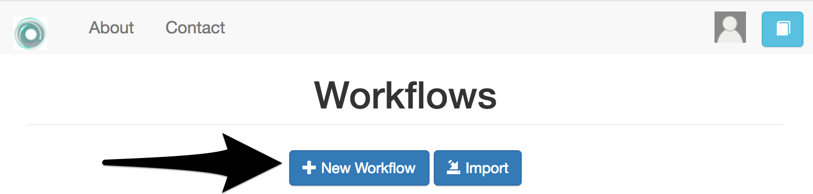

The icon in the top right corner next to your profile image is a link to the OnTask documentation. Click in the button to create a new workflow and enter its name and a description.

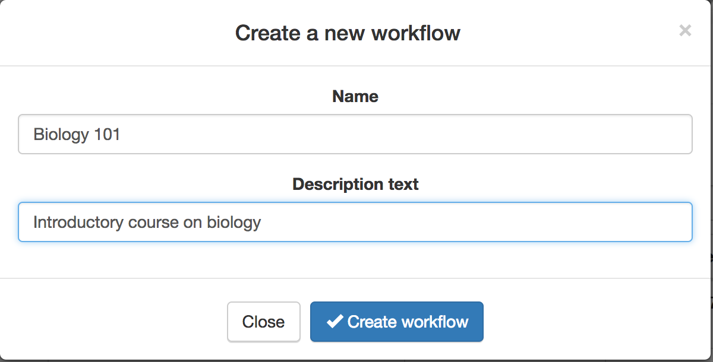

Once you created the workflow the platform shows the list of all the
workflows available.

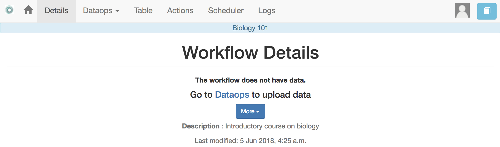

The first step is to select or *open* a workflow by clicking on the name to manipulate it. Once this operation is done, the access to the element is blocked for any other users (in case the workflow is being shared) to prevent two users changing the data or the actions simultaneously. The following screens will show the name of the selected workflow at the top. If you want to select another workflow to manipulate, you simply click in the OnTask icon at the top left corner of the screen to go back to the initial table.

Open a workflow
===============

When you open a workflow, a page with its details is shown like the one in
the following figure

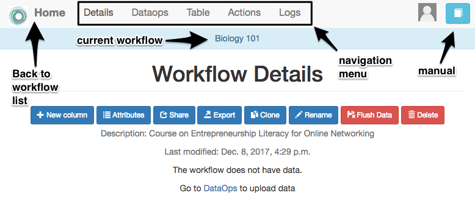

You can see the icon on the top right corner that links to the initial
page, and the icon in the top left corner that links to the documentation.
So far the page only shows the description of the workflow and the last
time it was modified because no data has been uploaded.

The top of the screen now shows the sections offering different operations
over the workflow:

Details
  Is the current page with information about the columns, data types,
  number of actions, etc.

Table
  Operations to visualize and manipulate the table (search for values, add a row, add a column)

Actions
  Operations to create the actions and conditions.

Logs
  A table showing the history of operations performed on this workflow

The buttons immediately under title *Workflow Details* show some of the operations available at this point:

- :ref:`New column <details_add_column>`

- :ref:`Attributes <details_attributes>`

- :ref:`Share <details_sharing>`

- :ref:`Export <details_export>`

- :ref:`Rename <details_rename>`

- :ref:`Delete <details_rename>`

Data Upload
===========

We now upload the data included in the file :download:`learner_information.csv <../Dataset/learner_information.csv>`. Click in the *Dataops* menu, and then in the option to *Data Upload/Merge* to see the following page:

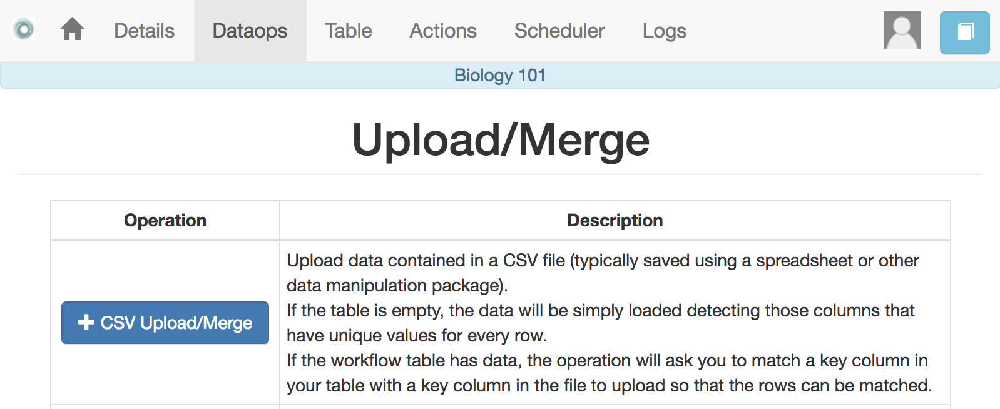

The next screen asks you to choose a file to upload the data. You can optionally specify a number of lines to skip at the top or bottom of your data file. This is useful when the CSV file is produced by another tool and contains some of these lines that have to be ignored.

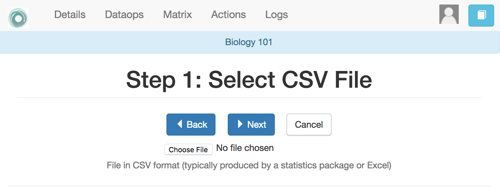

Choose the file :download:`learner_information.csv <../Dataset/learner_information.csv>` and proceed to the next step. The next screen shows the name of the columns detected in the file, the type (also automatically detected), a pre-filled field with the column name (in case you want to change it), and if it is a *key column* (there are no repeated values in all the rows).

.. figure:: ../Ontask_screens/06_data_csvupload_student_list.png
   :align: center

The *key* columns are highlighted because a workflow must have at least one column of this type in its table. Select all the column (clicking in the top element labeled *load*) and click on the *Finish* button, and then back to the
*Details* page to see the summary of the information in the workflow.

You can now see the information about the columns present in the workflow as shown in the following figure

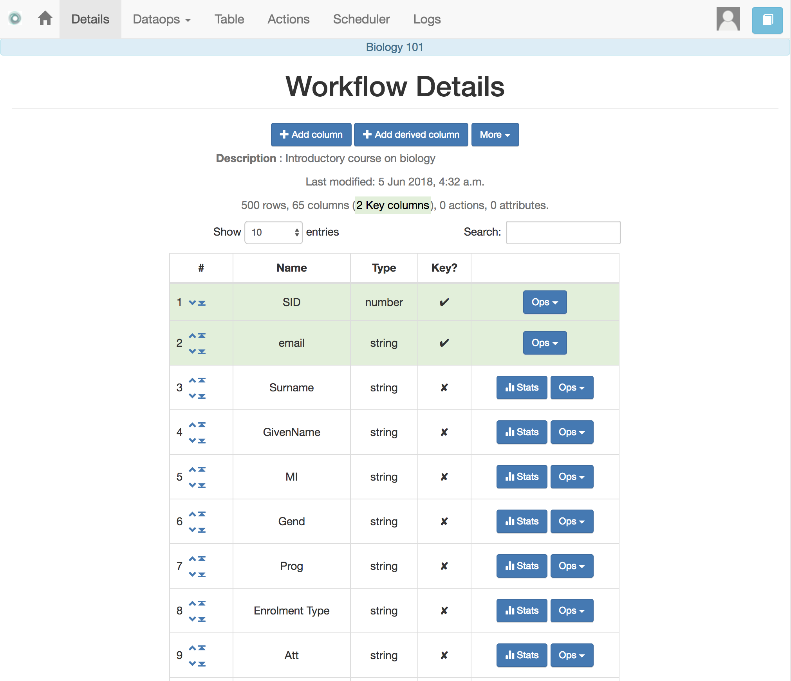

For each column you can change its name, description, type, position in the table and key attributes, or delete it from the workflow (icons in the left most column of the table). You can also use the arrows in the first column to adjust the order in which the columns are stored. For example, the following figure shows the information after relocating the columns in position 3-8.

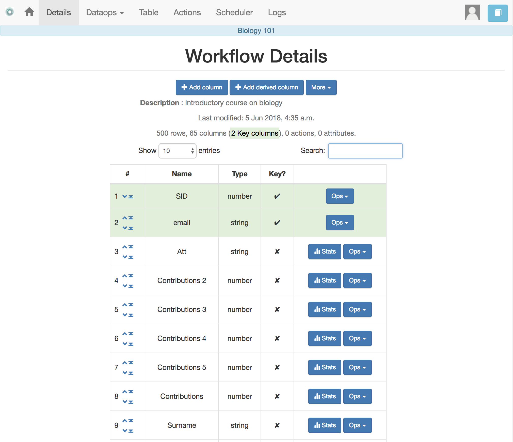

Workflow Operations
===================

There are several operations available at the details page.

Attributes
----------

If you click again in the *Details* link at the top of the screen you will see again the page with the workflow details, but this time it will include the information about the columns just loaded.

You can define a set of *attributes* in the workflow. This is simply a set of pairs *name, value* that you can use to have a single place where a value is defined and then reused in several other locations. For example, the name of the course is probably going to appear in various communications with the learners. If you define the attribute *Course_name* with that value, you can then refer to the attribute and it will be replaced by its value.

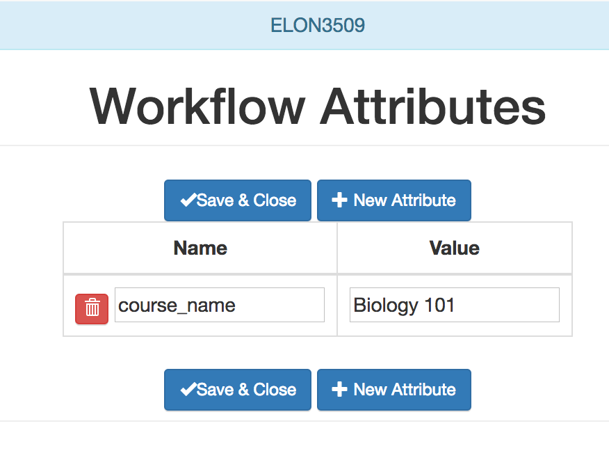

Share
-----

You may share a workflow with other instructors in the platform. The *Share* button will allow you to add/remove other users to this list.

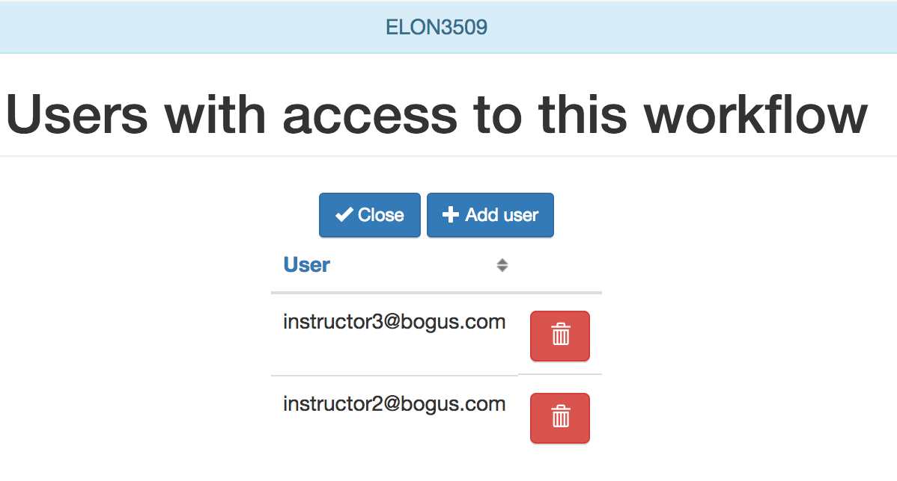

Remember that whenever you open a workflow, it becomes unavailable for the other users with whom it is being shared.

Export
------

This functionality allows you to take all the information included in a workflow and export it. The functionality offers the option of including in the export only the data, or the data and the actions.

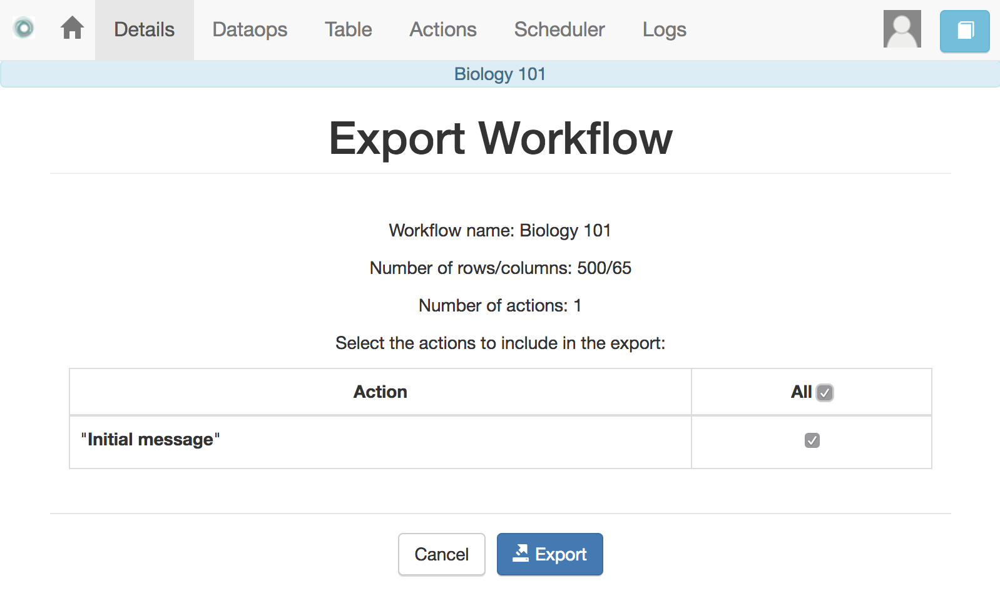

Clone
-----

This button creates a clone of the workflow with the a name containing the prefix "*Copy of*". Once the operation is executed, the workflow is available in the home screen (link in the upper left corner of the screen).

Rename
------

Use this function to change the name and description of the workflow

Flush Data
----------

This function deletes the data associated with the workflow. It maintains the
set of attributes and the actions, but it removes the conditions and filters
from all the actions.

Delete
------

This function deletes completely the workflow from the platform.

Browsing the table
==================

Once the data has been uploaded, click in the *Table* link at the top of the screen. The following screen shows the values stored in the table

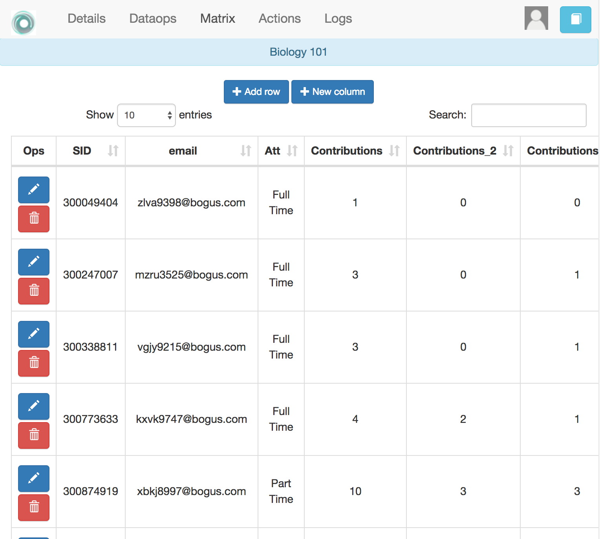

Table Views
-----------

For tables with large number of columns and/or rows OnTask allows you to define a *view* of the table that shows only a subset of the rows and/or a subset of the columns. To create a view click first in the *Views* button at the top of the page showing the table and then the button to add a view. Insert a name, description and select some of the columns a shown in the following figure.

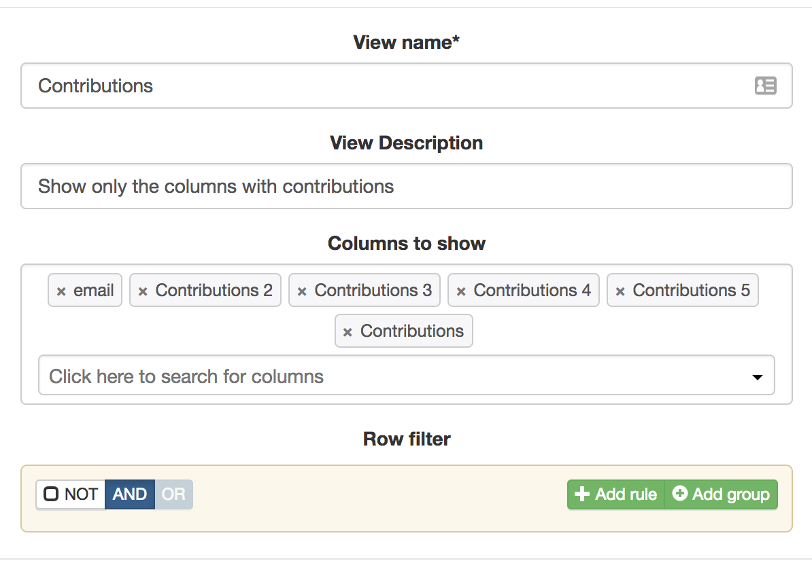

Save the definition of the view and now click in the *Table* button that appears in the page showing all the available views. The table is shown but only with the selected columns. The buttons at the top of the page allow you to edit the view (change the rows and columns selected), or select another available view.

Column and Row Statistics
-------------------------

If you click in the button with the column name and select the *Stats* link, OnTask shows a page with an statistical description of the values in that column. The analogous option is available as part of the operations (button *Ops*) in the row. The page shows identical representations than in the case of the column stats, but for each of the columns, the words *Your value* appear in the location corresponding to the values of the selected row (that typically correspond to one learner).

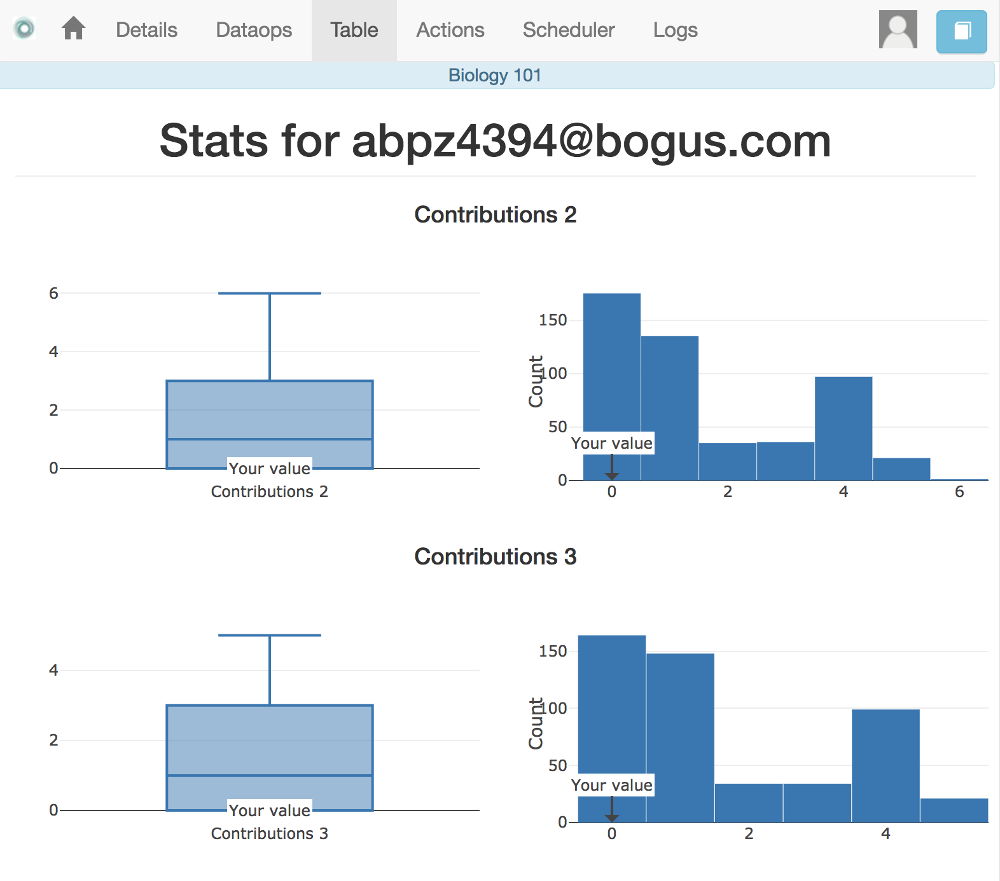

Actions
=======

Click in the *Actions* link at the top of the screen. The next screen shows
the list of actions that are part of the workflow, and if there is none, you
will only see the buttons to crate a new ones.

.. figure:: ../Ontask_screens/22_rule_initial.png
   :align: center

Actions Out
-----------

Click on the button to create a new *Action Out* and provide a name and a
description.

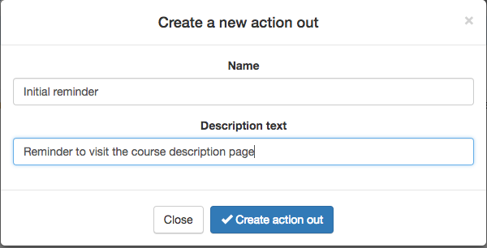

The next screen is the *action editor*. The functions are divided into three areas. The one at the top allows you to specify a condition to select or filter a subset of students. The second contains the conditions to be used in the personalized text. The third is a HTML text editor with the content to personalize.

.. figure:: ../Ontask_screens/24_action_edit.png
   :align: center

Place the cursor in the text area and start the text with a salutation, then select the name of a column from the pull-down menu right above the text editor and select the column *GivenName*. The string `{{ GivenName}}` appears in the text area. This notation is to instruct the next steps to replace the value among double curly braces with the name of each student.

Click now in the button *New* in the condition area. A form appears to
introduce the name, description and formula. The formula may contain any
combination of Boolean operators with respect to the column values. For
example, the condition::

  Q01 is equal to 0 AND Q02 is equal to 0

can be encoded in the formula widget as shown in the following figure

.. figure:: ../Ontask_screens/25_action_condition_edit.png
   :align: center

We can now use this condition to control the appearance of text in the text
area. Write a sentence that you would like to appear, select it and then
click in the arrow button in the condition.

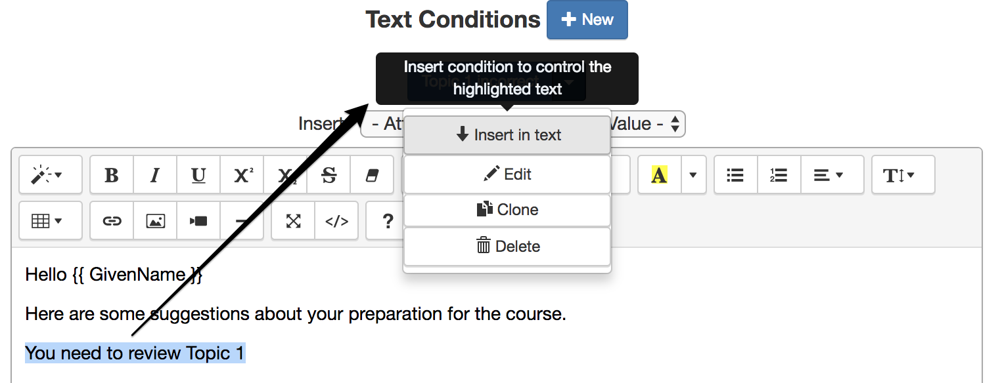

The text area is then surrounded by two marks::

  You need to review Topic 1

This is the encoding to instruct the processing step to check the value of
the condition ``Topic 1 incorrect`` and include the surrounded text only if
the condition is true.

You may also insert any attributes attached to the workflow. The attribute
name will be replaced by its value when processing the text.

In some cases, you may want to create an action only for a subset of the learners. OnTask allows this functionality by defining a *Filter* at the top of the action-out editor. For example, the following filter 

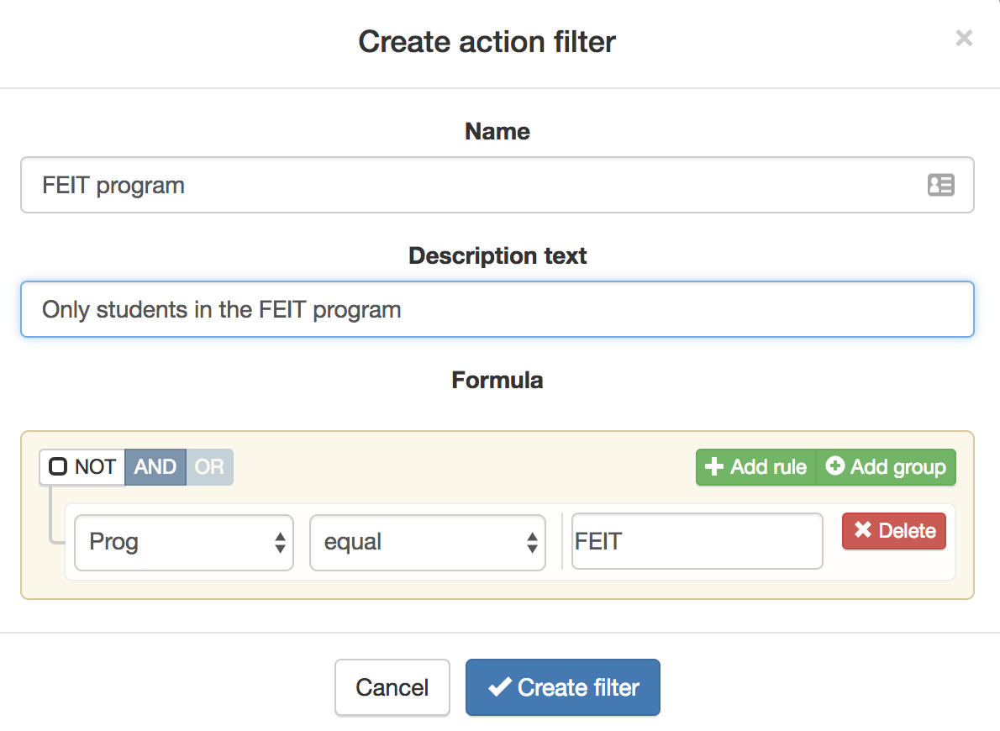

Once the filter is saved, the application informs how many rows in the table are selected by the expression written in the filter.

The text in the action will be instantiated for each row in the table (or the subset specified by the filter) and all conditions and fields will be evaluated in the context of the values stored in the table. In other words, if a sentence is surrounded by one of the conditions, its text will appear in the final text if the condition evaluates to true with the values stored in the table for that particular row.

Within the action-out editor you may see the appearance of the text for each of the entries in the table by clicking in the *Preview* button at the bottom of the screen.

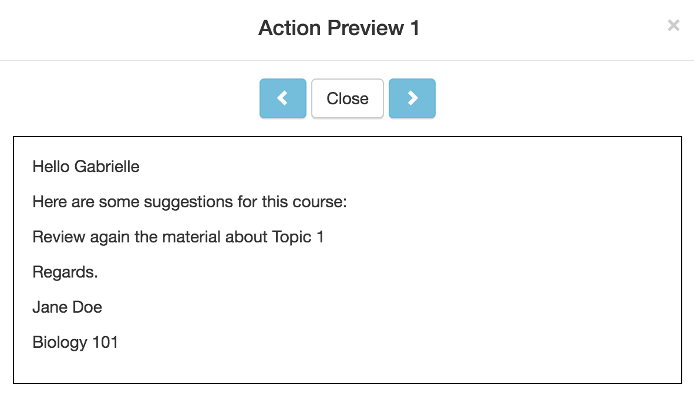

Sending Emails
^^^^^^^^^^^^^^

Once you define an action-out, you may send emails to the learners in the table (or the subset selected by the filter, if defined). From the page that shows all the actions in the workflow (*Actions* link in the navigation menu at the top of the page), click in the *Email* button for the corresponding action. The form in the following screen allows you to select several additional features.

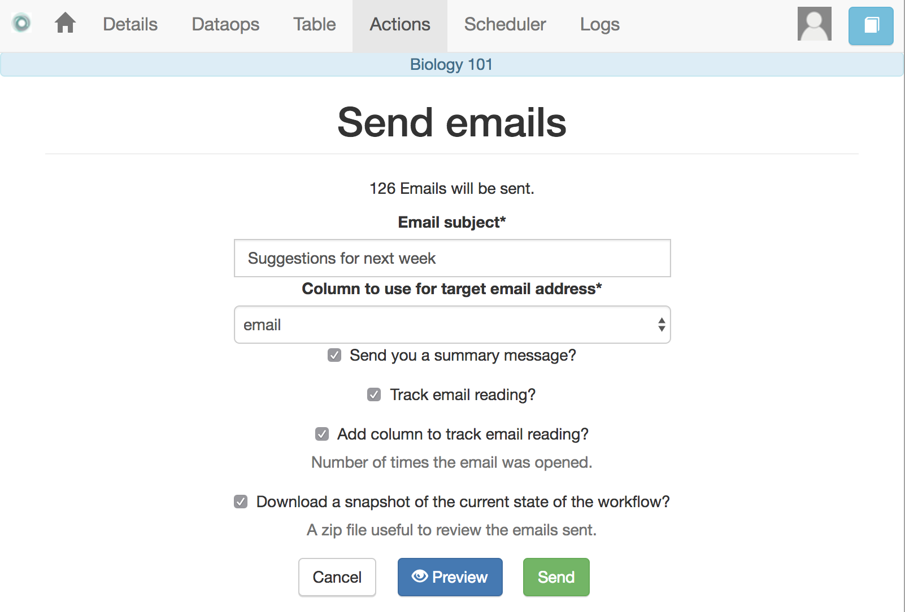

The button *Preview* at the bottom of the page allows to check again the final appearance of the message that will be sent to the users.

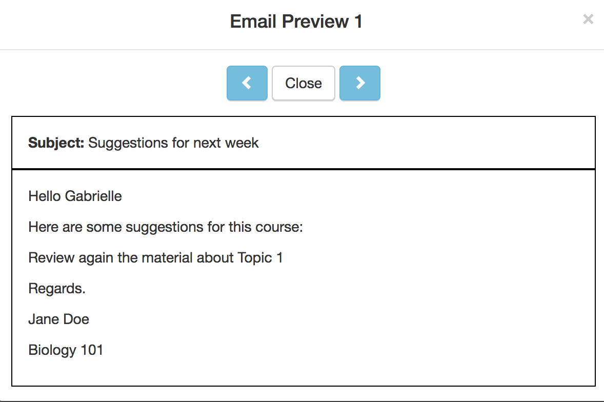

If selected, once. the email messages are sent, a summary message is sent to the email address of the user account, and a snapshot of the workflow is downloaded. This workflow snapshot can be imported through the home page and create an exact replica of the workflow when the messages were sent, for future reference.

Making content available through OnTask
^^^^^^^^^^^^^^^^^^^^^^^^^^^^^^^^^^^^^^^

Sending an email through OnTask is one possible way to offer the personalized content to the learners. Alternatively, OnTask assigns a unique URL to each action that can be given to the learners and (if the authentication layer of the application verifies learner requests appropriately) shows the corresponding personalized text to the learners. The URL, the option to enable/disable it and an optional time window validity is available through the link *URL*. 

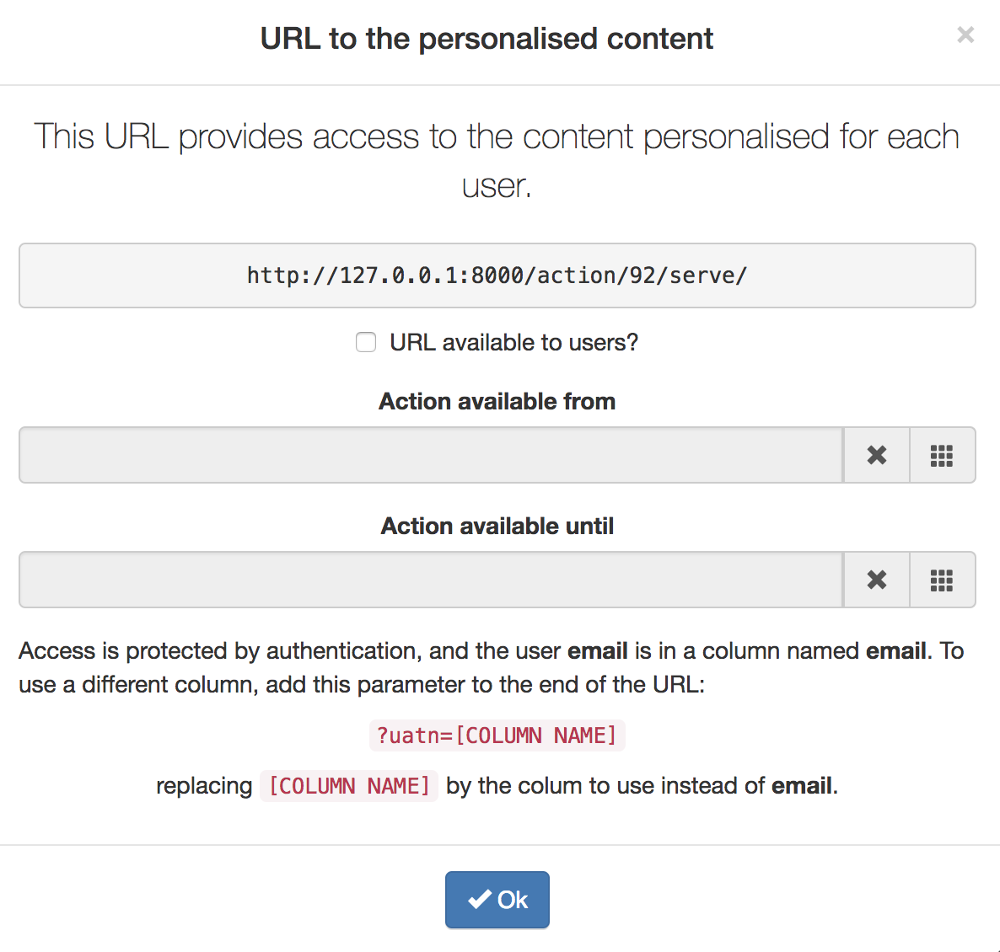

Actions In
----------

These actions offer the possibility of collecting data by directly asking students a set of questions. This functionality could be considered as a *simplified survey engime*. The action consists of a document with a paragraph introducing a set of questions. Each  question corresponds with a column in the workflow, and the text describing that columns is used as the question text. To create one of these actions click in the button *New Action In*. The description of the action will be used as the introductory text for the survey.

.. figure:: ../Ontask_screens/33_action_in_create.png
   :align: center

After the action is created, an editor similar to the action out is shown.

.. figure:: ../Ontask_screens/34_action_in_edit.png

This editor allows you to specify several elements of the action, more precisely:

Filter learners
  An expression to select a subset of the learners for which the action (or survey) will be offered.

Description
  A text used to describe the set of questions.

Key column to identify learners
  The column in the table that will be used to identify the users when submitting their answers. This is typically the column that contains the user email.

Columns to obtain data
  The columns that will be used to collect the data. You may choose an existing column, create a new one, or create a new derived one (the values are crated by combining values from other columns and an operator).

The editor will remind you that you need to choose one key column before the action is ready to be used, and that it would be desirable to have a description (or question text) for each of the columns. Let's suppose you want to ask the learners two questions:

- What was the most challenging topic for you this week? 

- What was your dedication to the course this week?

And in order to make the data suitable for further processing, we would like to define a set of pre-defined answers. You can easily define this by creating a new column

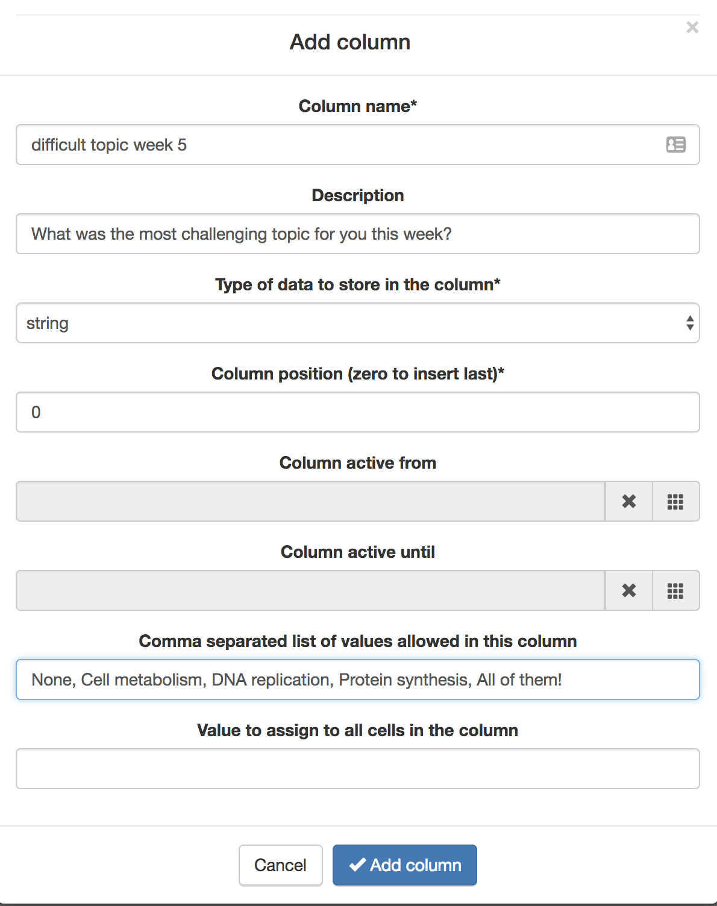

and analogously, the second column

.. figure:: ../Ontask_screens/35_action_in_new_column2.png
   :align: center

You can now add these columns to the action and the editor will show them in the table at the bottom as shown in the following figure

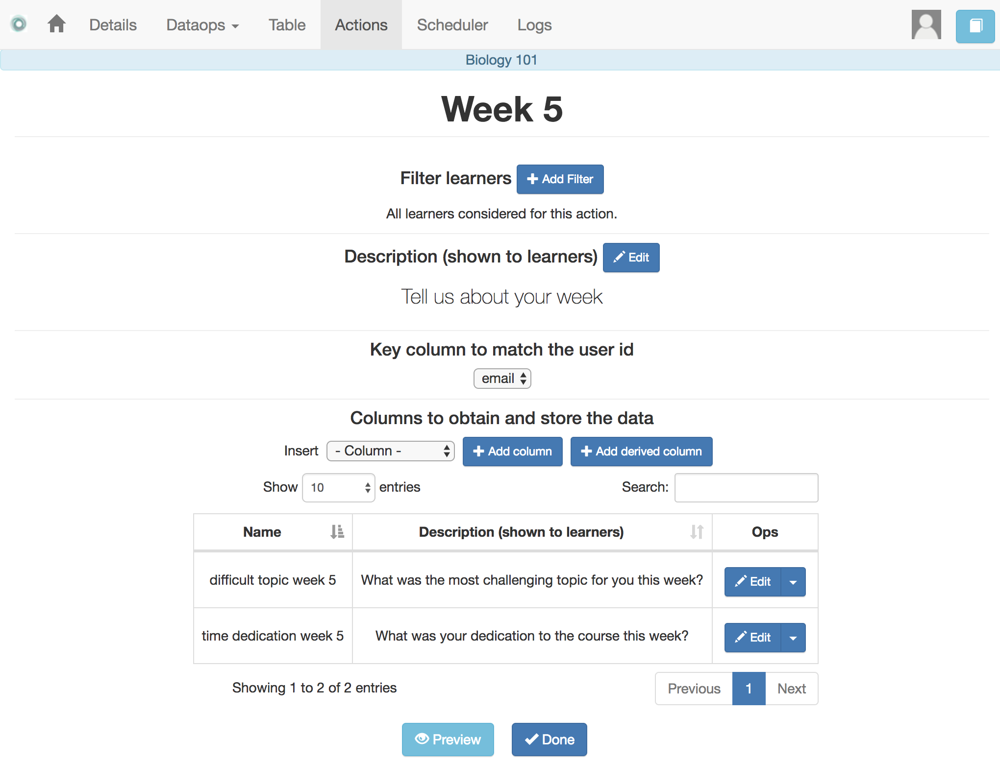

You may see how these questions will be shown to the users with the *Preview* button.

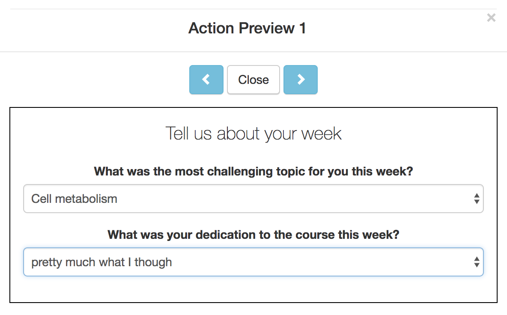

Once created, you may select the URL from the action table and make it available for learners to enter their answers, which will be automatically added to the table in the workflow and ready to be used as part of the conditions to create personalized content.

A Predictive Model
------------------

Suppose that your favorite data analyst has processed the data set and created a predictive model that estimates the score of the final exam based on the value of the column *Contributions* applying the following linear equation::

  final exam score = 3.73 * Contributions + 25.4

You would like to incorporate this model to the workflow and use the predicted final exam score as another column to create conditions and personalize content. One way to achieve this is by creating a plugin that given the two coefficients of a linear model (in the example 3.73 and 25.4) returns a new data set with a column with the values obtained using the corresponding equation. In order for the plugin to comply with the  :ref:`requirements <plugin_requirements>`, one possible definition would be:

.. literalinclude:: __init__.py
   :language: python

