.. _tutorial:

Tutorial
********

Before you start the tutorial make sure you have an instructor account in an
OnTask server. Also, download and unpack the zip file :download:`dataset.zip
<../Dataset/dataset.zip>` that contains a synthetic data set
with the following files: ``student_list.csv``, ``midterm_results.csv``,
``forum_participation.csv``, ``blended_participation.csv`` and ``all_data.csv``.
The data has been extracted from the hypothetical scenario shown in the
following figure.

.. figure:: the_dataset.png
   :width: 100%
   :align: center

We assume that a learning experience is through its sixth week. From weeks 2
to 5 learners were engaging with two videos and to set of questions per week.
In Week 6 students took a midterm examination consisting of 10 questions
(about 5 topics, 2 question per topic). Additionally, during these six weeks
a discussion forum has been available for them to make comments. The
information contained in each file is:

``student_list.csv``
  File with student id (SID), email, name, gender, course id (`UOS Code`),
  Degree (`FSCI`, `FEIT`, `FASS` or `SMED`), type of enrolment (`HECS`,
  `Local` or `International`) and attendance (Full Time or Part Time).

``midterm_results.csv``
  File with student id (SID), email, name, the result of the 10 multiple
  choice questions (1 means correct, 0 means incorrect) and the total exam
  score (0-100).

``forum_participation.csv``
  File with student id (SID), days online, views, contributions and questions
  for weeks 2-5, and the accumulated value for all weeks.

``blended_participation.csv``
  File with student id (SID), Video, questions answered, and questions
  answered correctly (for two items) for weeks 2-5.

``all_data.csv``
  All data from the previous files properly combined into a single file.

Remember the three central concepts in OnTask:

Workflow
  A container with the data (table), a set of procedures to manipulate
  columns, data upload and a set of actions. This entity is typically
  associated with a course, but it could also model an entire degree.

Table
  A two-dimensional structure in which each row represents a learner, and
  each column a learner attribute such as the score in an assessment, class
  attendance, number of interventions in the discussion forum, engagement with
  videos, etc.

Actions
  An action in OnTask can be one of two entities:

  * A HTML resource of which certain parts are included or excluded based on
    a set of **conditions** created with the learner attributes (for example,
    number of interventions in the forum is larger than five, and number of
    times a video was watched is larger than 2).

  * A set of questions that are shown to the students and their answers are
    incorporated to the data table.

The following figure represents the high level view of the tool.

.. figure:: drawing.png
   :align: center

The next sections explain how to perform various operations in OnTask.

.. _create_workflow:

Create a workflow
=================

Log into the tool and click in the tool icon on the top left corner of the
screen. If you have an instructor account, you will see the buNew tton to
create a new workflow as shown in the following figure.

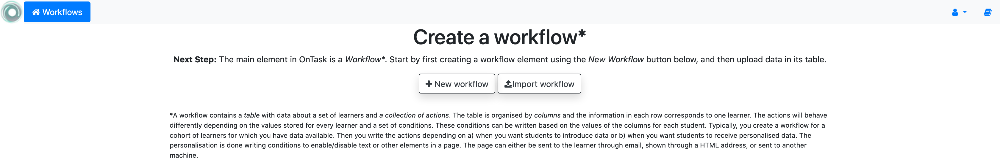

The icon in the top right corner next to your profile image is a link to the
OnTask documentation. Click in the button to create a new workflow and enter
its name and a description.

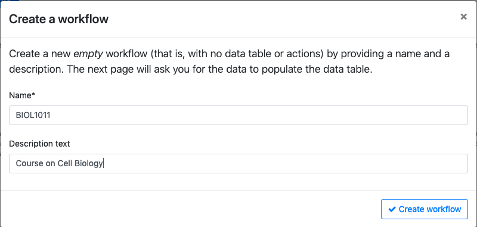

After creating the workflow opens it and shows the screen to
upload data to the table. The current workflow is shown underneath the top
menu as shown in the following figure (the string *BIOL1011* with a blue
background).

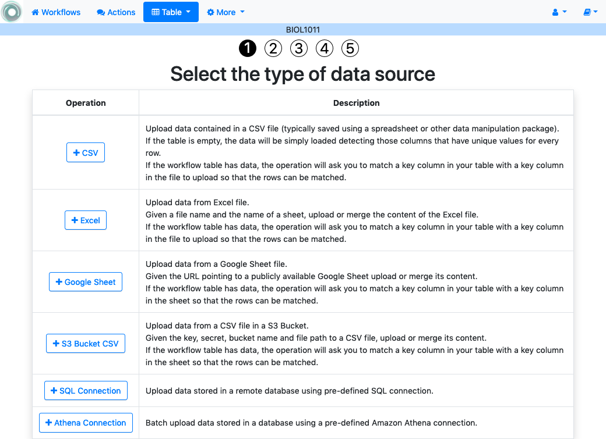

You can always click in the *Workflows* item at the top menu to go back to
the home page and select a different workflow to open (or create a new one).

.. figure:: ../scaptures/workflow_index.png

From the home page you can also perform some additional operations in the
worklow such as :ref:`rename and change the workflow
description<details_rename>`, :ref:`cloning (or creating and
exact replica of this workflow with another name)<details_clone>`,
:ref:`delete all data in the workflow table<details_flush_data>`, or
:ref:`delete the workflow<details_delete>`.

Open a workflow
---------------

When you open a workflow, a page with its details is shown like the one in
the following figure

.. figure:: ../scaptures/workflow_details_empty.png
   :align: center

In this case the page only shows basic details because the workflow does not
have any data stored in its table. While the workflow is open, the top menu
contains the following links:

Details
  Is the current page that shows information about the columns, data types,
  number of actions, etc. contained in the workflow (empty now because we
  haven't populated it)

Table
  Operations to visualize and manipulate the table (search for values, add a
  row, add a column)

Actions
  Create, edit and execute actions.

Logs
  A table showing the history of operations performed on this workflow

In the current *Details* page, immediately under the title there are buttons
to perform the following operations:

- Manage table data

  - :ref:`Upload or merge data to the table <data_upload>`

  - :ref:`Run a plugin to transform the data in the table <plugin_run>`

- Workflow operations:

  - :ref:`Edit the attributes <details_attributes>`

  - :ref:`Export the workflow <details_export>`

  - :ref:`Rename or change the workflow description <details_rename>`

  - :ref:`Share the workflow with other users in the platform <details_sharing>`

  - :ref:`Clone the workflow <details_clone>`

  - :ref:`Flush the data in the table <details_flush_data>`

  - :ref:`Delete the workflow <details_delete>`

.. _data_upload:

Data Upload
===========

We now will upload the data included in the file
:download:`student_list.csv <../Dataset/student_list.csv>`.
From the page showing the *Details* of the workflow, click in the *Manage
table data* button and select the option *Upload or merge data*:

Click in the *CSV Upload/Merge* button. The next screen asks you to choose a
file to upload the data. A CSV file is a text file in which the data is
organized by lines, and the data in the lines are separated by commas. A
conventional spreadsheet program can save the data in this format. When
uploading the file you can optionally specify a number of lines to skip at
the top or bottom of your data file. This is useful when the CSV file is
produced by another tool and contains some of these lines that have to be
ignored.

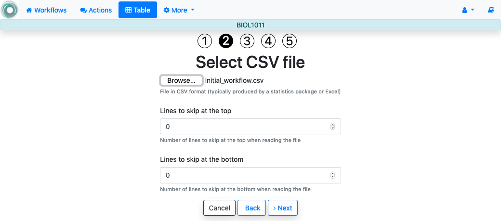

Choose the file :download:`student_list.csv
<../Dataset/student_list.csv>` and proceed to the next step. The next
screen shows the name of the columns detected in the file, the type (also
automatically detected), a pre-filled field with the column name (in case you
want to change it), and if it is a *key column* (there are no repeated
values in all the rows).

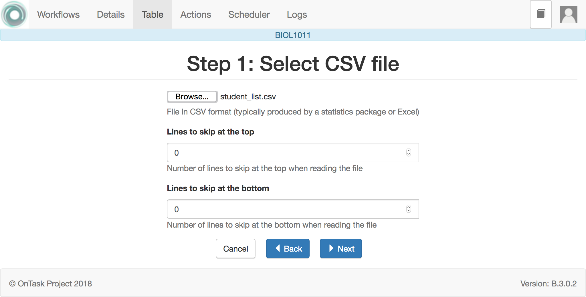

The *key* columns are highlighted because a workflow must have at least one
column of this type. Select all the column (clicking in the top
element labeled *load*) and click on the *Finish* button.

Workflow Details
================

The details page now shows the information about the columns as well as some
additional operations for the workflow.
You can now see the information about the columns present in the workflow as
shown in the following figure:

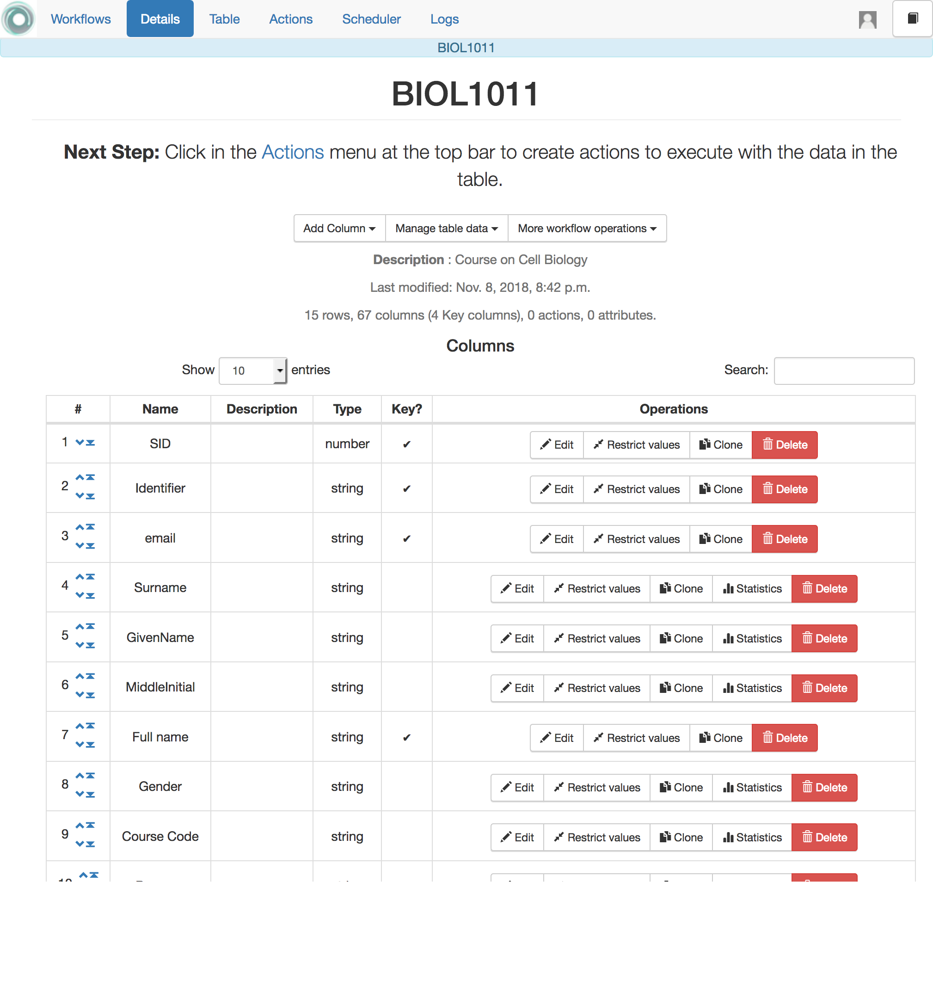

.. _tutorial_add_columns:

Adding columns
--------------

The left button in the area right below the title with name *Add Column*
allows you to perform the following three operation.

:ref:`Add a new column <details_add_column>`
  Use this function to add a new column to the data table manualy (as opposed
  to the ones that were automatically derived from the CSV file you uploaded.

:ref:`Add a formula-based column <details_add_formula_column>`
  This function is to create a new column containing the result of the data
  from existing columns combined with certain basic operands.

:ref:`Add a column with random values <details_add_random_column>`
  This function is to populate a new column with values randomly taken from a
   pre-defined collection.

Uploading or Merging additional data
------------------------------------

The button labeled *Manage table data* allows to execute the operation to
upload/merge new data to the table, or to execute an existing plugin.

Workflow operations
-------------------

The button with name *More workflow operations* offers the following
additional operations in the current workflow.

Workflow attributes
  You can define a set of *attributes* in the workflow. This is simply a set of
  pairs *name, value* that you can use to have a single place where a value is
  defined and then reused in several other locations. For example, the name
  of the course is probably going to appear in various communications with
  the learners. If you define the attribute *Course_name* with that value,
  you can then refer to the attribute and it will be replaced by its value.

Export workflow
  This functionality allows you to take all the information included in a
  workflow and export it. The functionality offers the option of including in
  the export only the data, or the data and the actions.

Rename workflow
  Use this function to change the name and description of the workflow.

Share workflow
  You may share a workflow with other instructors in the platform. The *Share*
  button will allow you to add/remove other users to this list. The other
  users will not be able to flush the data or delete the workflow. Whenever
  you open a workflow, it becomes unavailable for the other users with whom
  it is being shared until you either select another workflow or your session
   expires.

Clone workflow
  This button creates a clone of the workflow with the a name containing the
  prefix *Copy of*. Once the operation is executed, the workflow is
  available in the home screen (link in the upper left corner of the screen).

Flush Data
  This function deletes the data associated with the workflow. It maintains the
  set of attributes and the actions, but it removes the conditions and filters
  from all the actions.

Delete workflow
  This function deletes completely the workflow from the platform.

Browsing the table
==================

Once the data has been uploaded, click in the *Table* link at the top of the
screen to see the stored data:

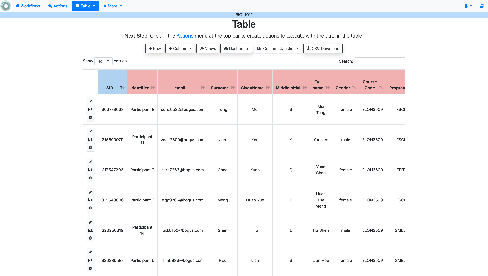

The buttons at the top of the page offer the following functionaity:

Add row
  It offers a page with a form to enter the data for a new row in the table.

Add column
  These operations are the ones discussed in the section
  :ref:`tutorial_add_columns`.

Manage table data
  The operations to either upload/merge new data on the table, or transform
  its content executing pre-installed program in the platform (plugin).

Dashboard
  This button leads to a page summarizing the content in each of the columns
  in the table. The values are shown as a histogram. For the columns with
  numeric values, a boxplot, minmum, maximum, mean, standard deviation and
  quartiles is also shown.

CSV Download
  Allows to download a CSV file with the information currently shown in the
  screen.

Table Views
-----------
For tables with a large number of columns and/or rows OnTask allows you to
define a *view* of the table that shows only a subset of it. To create a view
click first in the *Views* button at the top of the page and then the *Add
View* in the next page. Insert a name, description and select some of the
columns a shown in the following figure.

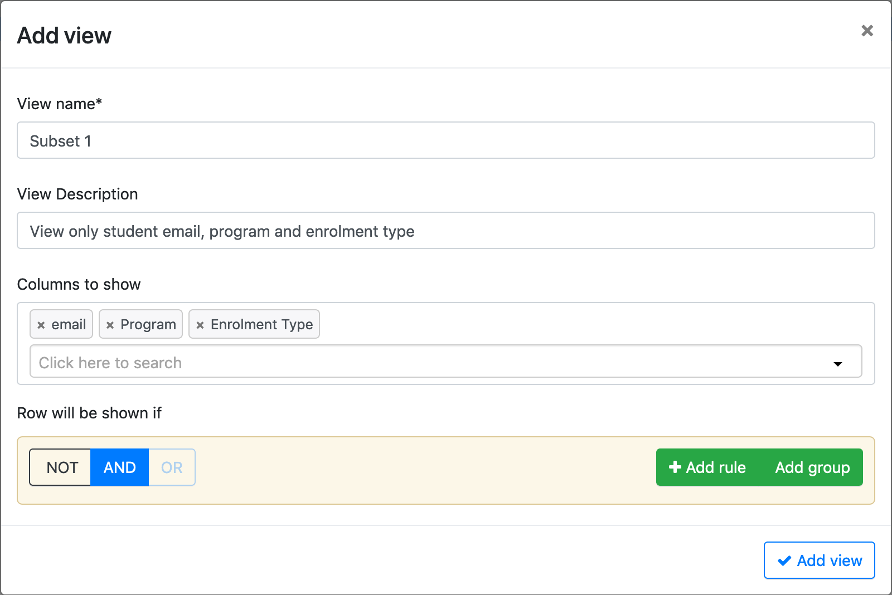

Save the definition of the view and now click in the *Table* button in the
operations for a vew. The appropriate table subset is shown. The buttons at the
top of the page allow you to edit the view (change the rows and columns
selected), or select another available view.

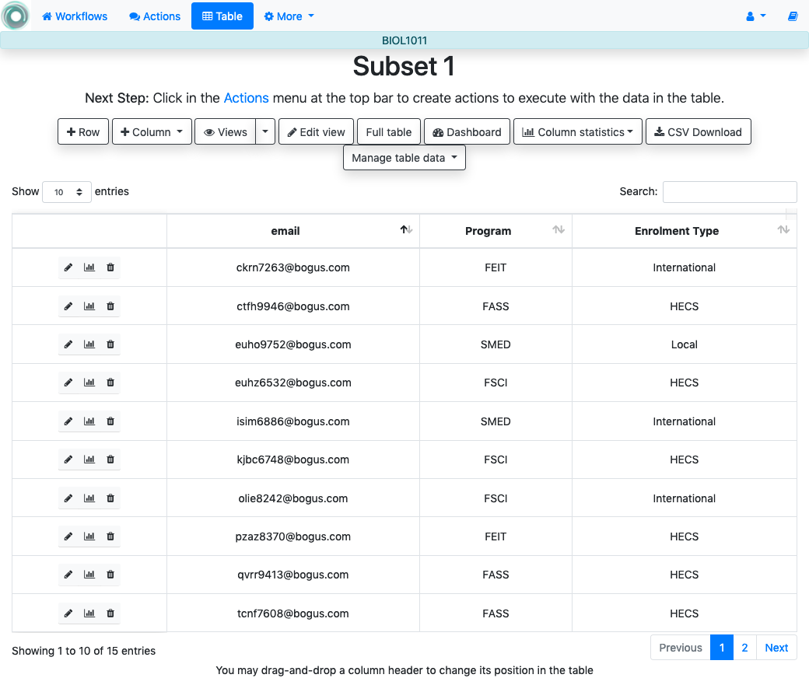

Column and Row Statistics
-------------------------

If you click in the button with the column name in any of the table view and
select the *Statistics*, OnTask shows a page with an statistical description
of the values in that column. The analogous option is available through the
*Operations* button in the row (left side of the table view). The page shows
identical representations than in the case of the column stats, but for each
column the words *Your value* appear in the location corresponding to the value
in the row.

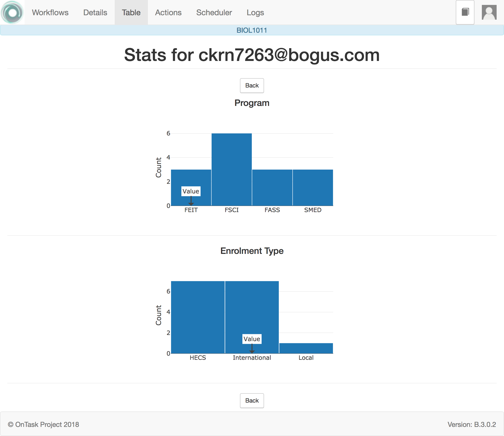

Actions
=======

Access the *Actions* page clicking in the link with the same name in the  top
of the screen. The next screen shows the list of actions that are part of
the workflow, and the buttons to create a new one, import, or manage the data
table.

.. figure:: ../scaptures/tutorial_action_index.png
   :align: center

Personalized text action
------------------------

Click on the button to create a *New Action*, provide a name, a description
(optional) and select the type *Personalized text*.

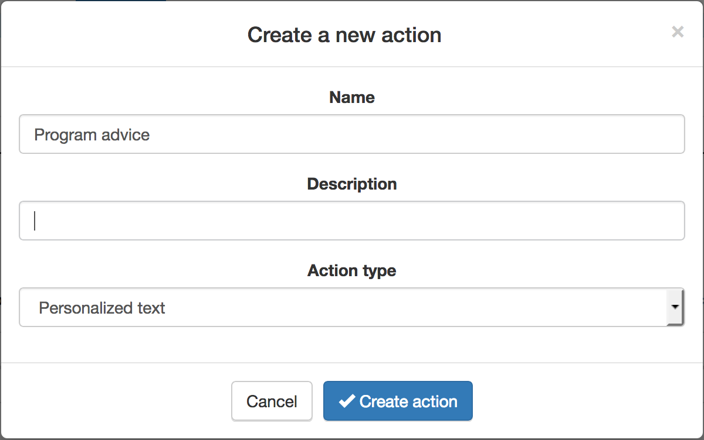

The next screen is the *personalized text action editor*. The functions are
divided into three areas.

.. figure:: ../scaptures/tutorial_personalized_text_editor.png
   :align: center

1. This section allows to define a *filter*, or a condition to select a subset
   of the learners for which this action will be considered.

2. This section contains the conditions to be used in the personalized text.

3. This area is the HTML text editor to write the content to personalize.

Place the cursor in the text area and start the text with a salutation. Then
click in the pull down menu next to *Insert* with the value *Column name*.
Select the column *GivenName*. The string `{{ GivenName}}` appears
in the text area. This notation is to instruct the next steps to replace the
value among double curly braces with the name of each student.

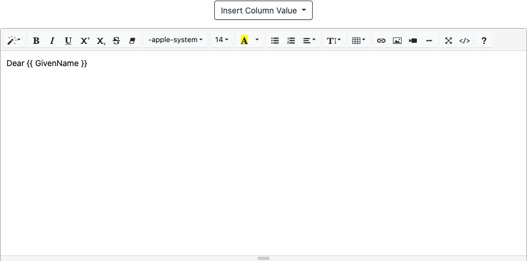

Click now in the button *New* in the condition area. A form appears to
introduce the name, description and formula. The formula may contain any
combination of Boolean operators with respect to the column values. For
example, the condition::

  Program equal to FASS

can be encoded in the formula widget as shown in the following figure

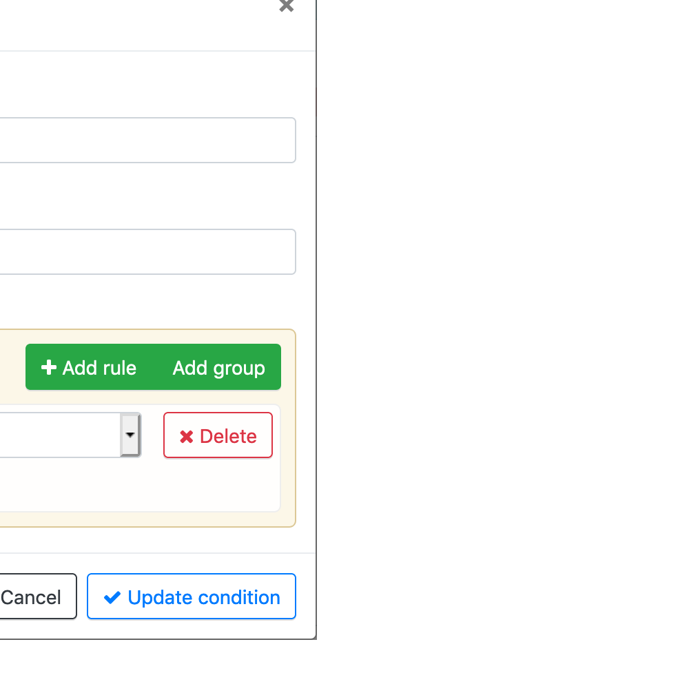

We now use this condition to control the appearance of text in the editor.

- Write a sentence in the editor below the greeting.

- Select it

- Click in the arrow button next to the condition name and select *Insert in
  text*.

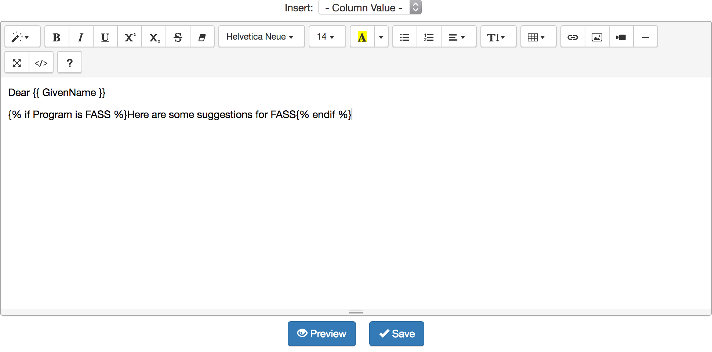

The text area is then surrounded by two marks::

  Here are some suggestions for FASS

This is the format to instruct the processing step to check the value of
the condition ``Program is FASS`` and include the surrounded text only if
the condition is true.

Selecting only a subset of learners
^^^^^^^^^^^^^^^^^^^^^^^^^^^^^^^^^^^

In some cases, you may want to create an action only for a subset of the
learners. OnTask allows this by defining a *Filter* at the top
of the editor. For example, the following filter:

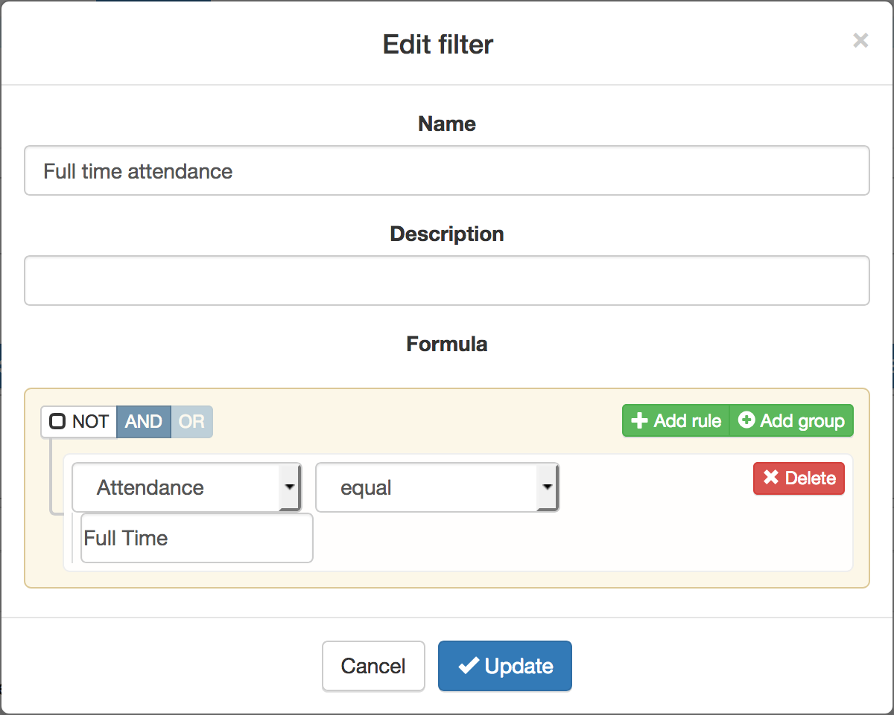

Once the filter is saved, the application informs how many rows in the table are selected by the expression written in the filter.

The text in the action will be instantiated for each row in the table (or the subset specified by the filter) and all conditions and fields will be evaluated in the context of the values stored in the table. In other words, if a sentence is surrounded by one of the conditions, its text will appear in the final text if the condition evaluates to true with the values stored in the table for that particular row.

Within the action-out editor you may see the appearance of the text for each of the entries in the table by clicking in the *Preview* button at the bottom of the screen.

.. figure:: ../scaptures/30_action_out_preview.png
   :align: center

Sending Emails
^^^^^^^^^^^^^^

Once you define an action-out, you may send emails to the learners in the table (or the subset selected by the filter, if defined). From the page that shows all the actions in the workflow (*Actions* link in the navigation menu at the top of the page), click in the *Email* button for the corresponding action. The form in the following screen allows you to select several additional features.

.. figure:: ../scaptures/31_action_out_email.png
   :align: center

The button *Preview* at the bottom of the page allows to check again the final appearance of the message that will be sent to the users.

.. figure:: ../scaptures/31_action_out_email_preview.png
   :align: center

If selected, once. the email messages are sent, a summary message is sent to the email address of the user account, and a snapshot of the workflow is downloaded. This workflow snapshot can be imported through the home page and create an exact replica of the workflow when the messages were sent, for future reference.

Making content available through OnTask
^^^^^^^^^^^^^^^^^^^^^^^^^^^^^^^^^^^^^^^

Sending an email through OnTask is one possible way to offer the personalized content to the learners. Alternatively, OnTask assigns a unique URL to each action that can be given to the learners and (if the authentication layer of the application verifies learner requests appropriately) shows the corresponding personalized text to the learners. The URL, the option to enable/disable it and an optional time window validity is available through the link *URL*. 

.. figure:: ../scaptures/32_action_out_url.png
   :align: center

Actions In
----------

These actions offer the possibility of collecting data by directly asking students a set of questions. This functionality could be considered as a *simplified survey engime*. The action consists of a document with a paragraph introducing a set of questions. Each  question corresponds with a column in the workflow, and the text describing that columns is used as the question text. To create one of these actions click in the button *New Action In*. The description of the action will be used as the introductory text for the survey.

.. figure:: ../scaptures/33_action_in_create.png
   :align: center

After the action is created, an editor similar to the action out is shown.

.. figure:: ../scaptures/34_action_in_edit.png

This editor allows you to specify several elements of the action, more precisely:

Filter learners
  An expression to select a subset of the learners for which the action (or survey) will be offered.

Description
  A text used to describe the set of questions.

Key column to identify learners
  The column in the table that will be used to identify the users when submitting their answers. This is typically the column that contains the user email.

Columns to obtain data
  The columns that will be used to collect the data. You may choose an existing column, create a new one, or create a new derived one (the values are crated by combining values from other columns and an operator).

The editor will remind you that you need to choose one key column before the action is ready to be used, and that it would be desirable to have a description (or question text) for each of the columns. Let's suppose you want to ask the learners two questions:

- What was the most challenging topic for you this week? 

- What was your dedication to the course this week?

And in order to make the data suitable for further processing, we would like to define a set of pre-defined answers. You can easily define this by creating a new column

.. figure:: ../scaptures/35_action_in_new_column.png
   :align: center

and analogously, the second column

.. figure:: ../scaptures/35_action_in_new_column2.png
   :align: center

You can now add these columns to the action and the editor will show them in the table at the bottom as shown in the following figure

.. figure:: ../scaptures/36_action_in_edit_complete.png
   :align: center

You may see how these questions will be shown to the users with the *Preview* button.

.. figure:: ../scaptures/37_action_in_preview.png
   :align: center

Once created, you may select the URL from the action table and make it available for learners to enter their answers, which will be automatically added to the table in the workflow and ready to be used as part of the conditions to create personalized content.

Scheduling Emails
=================

Work in progress.

Merging Data
============

Work in progress

Uploading Data from a Remote Database
=====================================

Work in progress

Plugins: Write your own data processing code
============================================

Example: A Predictive Model
---------------------------

Suppose that your favorite data analyst has processed the data set and created a predictive model that estimates the score of the final exam based on the value of the column *Contributions* applying the following linear equation::

  final exam score = 3.73 * Contributions + 25.4

You would like to incorporate this model to the workflow and use the predicted final exam score as another column to create conditions and personalize content. One way to achieve this is by creating a plugin that given the two coefficients of a linear model (in the example 3.73 and 25.4) returns a new data set with a column with the values obtained using the corresponding equation. In order for the plugin to comply with the  :ref:`requirements <plugin_requirements>`, one possible definition would be:

.. literalinclude:: ../../src/plugins/test_plugin_1/__init__.py
   :language: python

Application Programming Interface (API)
=======================================

Work in progress

