.. _using:

**************
Using the tool
**************

.. contents:: Table of Contents
   :local:
   :backlinks: none
   :depth: 3

In a nutshell, the idea of OnTask is to help instructors, learners and designers to exchange data  about what is happening in a learning experience to design and deploy personalized learner support actions. This last term, *personalized support actions* is purposefully vague to include any action that is offered to learners in different forms depending on personalized conditions. The typical *workflow* to use OnTask starts by uploading and combining available data about the learning experience, either provided through some platform (LMS, video platform), provided by the students (questionnaires), or reported by the instructors. The instructors then write simple rules to select a subset of students and create a resource (HTML page, a message, a visualization) so that its content depends on the data available for each learner. The following figure shows an illustration of this workflow:

.. figure:: ontask_workflow.png
   :align: center
   :width: 100%

Imagine a learning experience in which you want to provide personalized messages to the learners in three instances. In the first week, you want to send a welcome email and change slightly the text based on the student background (courses taken before this one). The second week you want to send some comments and suggestions about the participation in the forum and the text will depend on the measures of engagement obtained from the platform. Finally, you want to send a third personalized email depending on the level of engagement with the videos in the course. The idea of these messages is that you want to change the text in the message for each learner based on the information stored in the table.

The main entity in the platform is a :ref:`*workflow* <workflow>` and represents a set of data capturing procedures, a table with current data, and a set of actions. The usual steps require first to populate the table with data extracted from the learning environment. In the figure we assume a variety of data sources ranging from those coming from the use of technology, self-reported by the students, or observed and reported by the instructors.

These three sources are combined and stored in the second entity in OnTask: the table. Think of the table as a conventional excel sheet storing the information about the learners (one learner per row and a set of features about each learner as columns).

The third entity in OnTask is the *personalized action* that is a text with elements that are selected and adapted to each learner based on a set of basic rules that depend on the student features stored in the table. This text can be included in an email, made available through a web page, or forwarded to another system for further processing.

A workflow in OnTask contains a single table (rows and columns) and a set of actions. This container is conceived to manage the data and actions related to a learning experience. You may use the workflow shown in the documentation importing  the :download:`ELON3509 workflow <../../initial_workflow.gz>`.

The following sections offer a more in-depth description of all these elements as well as examples with real scenarios.

.. _workflow:

The Workflow
============

    "But anyone who has experienced flow knows that the deep enjoyment it
    provides requires an equal degree of disciplined concentration."
    -― Mihaly Csikszentmihalyi

The workflow in OnTask is simply a container that brings together the table,
the operations to upload the data, and the actions to create the
personalized content. The initial screen in OnTask shows the available
workflows as shown in the following figure.

.. figure:: ../scaptures/workflow_index.png
   :align: center
   :width: 100%

Clicking in the home icon in the upper left corner brings you back to the
list of workflows from any page in the application. Clicking in the icon in
the upper right corner opens the documentation page.

The screen includes the following operations:

.. sidebar:: Going back

   Remember that clicking in the home icon in the upper left corner *closes* the
   workflow and you see the list of available workflows again.

1. Create a new workflow: Clicking in the *New Workflow* button will ask you
   for the name and description of the element.

.. _workflow_import:

2. Importing a file containing a previously exported workflow. Clicking in the
   *Import* button will ask you for the new for the new workflow, the file and
   will let you choose to import only the data, or the data and the actions as
   shown in the following figure

   .. figure:: ../scaptures/workflow_import.png
      :align: center
      :width: 100%

3. Open a workflow to work on it. This is perhaps the most common initial step.
   Once you open or *enter* a workflow, all the operations are applied to that
   context. The platform will remind you in which workflow you are working by
   inserting its name right under the top navigation bar as shown in the
   following figure.

   .. figure:: ../scaptures/navigation_bar.png
      :align: center
      :width: 100%

Once you open a workflow, it is locked and no other user can manipulate it (see
:ref:`sharing a workflow <details_sharing>`). If you access a workflow and
another user is currently using it, the platform will not allow you to
see the data and will show who is holding the lock.

The operations to manage a workflow all become visible once you select it by
clicking on its name.

.. _details:

Workflow Details
================

    "The details are not the details. They make the design"
    -- Charles Eames

After selecting a workflow to manage, the *details* page appears with a lot of
information about operations, structure of the data, information about the
columns, etc. The page contains the information shown in the following figure.

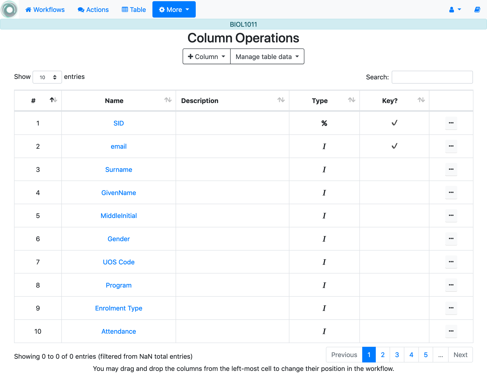

The name of the workflow is shown below the navigation bar. The page includes
links to additional menus with various operations on the selected workflow (some
 of them will be available depending on your user profile). Under the title
*Workflow Details* there are buttons to access the following operations:

.. _details_add_column:

Add a new column
  Opens a dialog to create a new column in the table. It requires the name,
  type of column, a comma separated list of allowed values (optional), the position
  of that column, and a value to assign to all cells in the column (optional).

  .. figure:: ../scaptures/workflow_add_column.png
     :align: center

.. _details_add_derived_column:

Add a derived column
  A derived column is a column created as a result of combining values from
  several existing columns using basic mathematical operations such as
  maximum, minimum, etc. The operation is executed **only** upon column
  creation. Changes in the source columns **will not be propagated** to the
  resulting combined column.

.. _details_attributes:

Attributes
  This is simply a dictionary of pairs ``(name, value)`` so that when a ``name``
  appears in a personalized text, it is replaced by the ``value``. The main use
  of these attributes is when a value has to appear in various locations and
  you may want to change all its occurrences. For example, the instructor name
  could be included as one of the attributes so that if it changes, modifying
  the attribute is the only required step.

  .. figure:: ../scaptures/workflow_attributes.png
     :align: center

.. _details_sharing:

Share
  A screen to make the workflow accessible to other users. You are supposed to
  know the user identification (there is no search functionality available).

  .. figure:: ../scaptures/workflow_share.png
     :align: center

.. _details_export:

Export
  This functionality allows you to take a snapshot (or a picture) of the content
  of the workflow and store it in a file for your records. You may select which
  actions are included in the exported file

  .. figure:: ../scaptures/workflow_export.png
     :align: center

  The menu offers you the possibility of exporting only the data, or the data
  **and** the :ref:`action <action>` in the workflow.

.. _details_clone:

Clone
  This function creates a new workflow by duplicating the data, actions and
  conditions of the current workflow. The new workflow will have the same
  name with the prefix "*Copy of *".

.. _details_rename:

Rename
  This functionality allows to change either the name or the description of the
  workflow.

  .. figure:: ../scaptures/workflow_rename.png
     :align: center

.. _details_flush_data:

Flush data
  This operation deletes all the data attached to the workflow, but preserves
  the workflow structure (that is, the name and the description only).

  .. figure:: ../scaptures/workflow_flush.png
     :align: center

  Given the destructive nature of this operation the platform requires you to
  confirm this step.

.. _details_delete:

Delete
  Operation similar to the previous one, but now the whole workflow is deleted
  and therefore unselected. If executed, the platform will go back to the list
  of workflows as this one is no longer available for operations.

  .. figure:: ../scaptures/workflow_delete.png
     :align: center

  As in the previous case, the platform asks for confirmation before carrying
  out the delete operation.

Under the buttons to carry out these workflow operations the platform shows a
summary of the information contained in the workflow.

.. _columns:

The Columns
-----------

The data in a workflow is stored in a structure called *a table* that is made
of rows and columns (similar to a spreadsheet). The details page
basically shows information about the available columns.

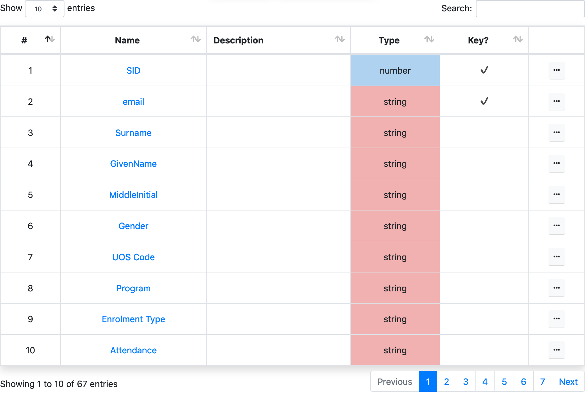

Each column has a position, name (cannot contain the quotes *'* or *"*), a type
(one of integer, string, double, boolean or date/time), a field stating if the
values of that column are unique for the rows, and operations. When a column is
marked as *Unique*, it means that all the values it contains are different and
unique for each row. Think of a column containing a passport number. Such
number is different for every person. There could be several columns with this
property. The application detects automatically this property in a column. You
may edit and change this properly as long as the values are the adequate ones
(they satisfy the uniqueness property if you try mark a column as unique). The
operations available over columns are:

Edit
  It allows you to change the name, type, unique and values allowed in the
  column. If you are changing the column type, the application will check if
  the existing values are valid. If not, the change will not be allowed.
  Similarly, if the *Unique* property is selected, the application checks the
  values to make sure this property is satisfied.

  .. figure:: ../scaptures/workflow_column_edit.png
     :align: center

  The column may also have a *validity window* defined by two date/times.
  This validity is used when executing *action in* tasks.

Clone
  Clones the column in the workflow changing its name adding the prefix "*Copy
  of *" to the name.

Delete
  Deletes the column from the workflow. If there are conditions inside
  *actions out* that use this column, those conditions will be removed from
  the action.

Stats
  In addition to these operations, OnTask also offers a visualization of the values in a column. x

.. _dataops:

Data Sources
============

    "May be stories are are just data without a soul"
    -- Brené Brown

This section describes the operations to upload and merge data into the table. It may be the case that this task is already done, or it is done automatically before you work with a workflow. If this is the case, you may skip this section. The data operations page offers various options to upload and merge data to the table and the process is divided into 2 to 4 steps.

CSV Files
---------

CSV or "comma separated value" files are plain text files in which the first line contains a comma-separated list of column names, and every subsequent line contains the values of these columns for each row. It is a popular format to exchange data that can be represented as a table, and it is for this reason that OnTask allows to upload data in this format.

The functionality assumes that you have such file available in your computer and provides a form to upload it to the platform.

.. figure:: ../scaptures/dataops_csvupload.png
   :align: center

Some applications produce CSV files but the data is surrounded with by a few lines that need to be ignored. If this is the case, you may specify how many of these lines are present in your file and OnTask will ignored them when parsing the content.

Excel Files
-----------

The second format supported by OnTask to upload or merge data is Excel.

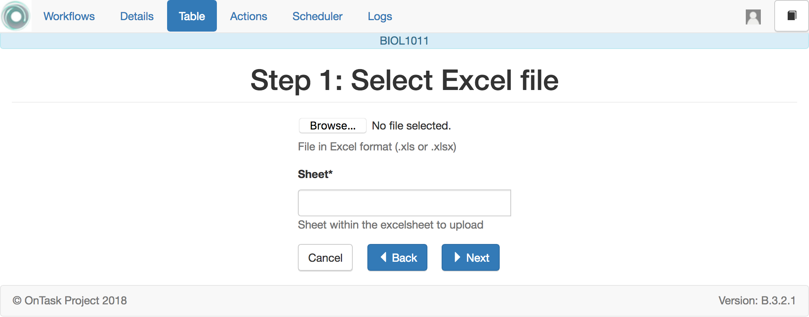

In this case the file is assumed to have multiple *Sheets* and one of them has to be selected to upload/merge the data.

.. _sql_connection_run:

SQL connection
--------------

The third method to upload/merge data into the current workflow is through a SQL connection to a remote database. These connections have to be :ref:`previously defined and configured by the system administrator <sql_connections>`. Instructor users can use them to access the content of a previously defined table in a remote database. When selected, the option to upload data with  a SQL connection shows the table of available connections and the possibility to *Run* such connection:

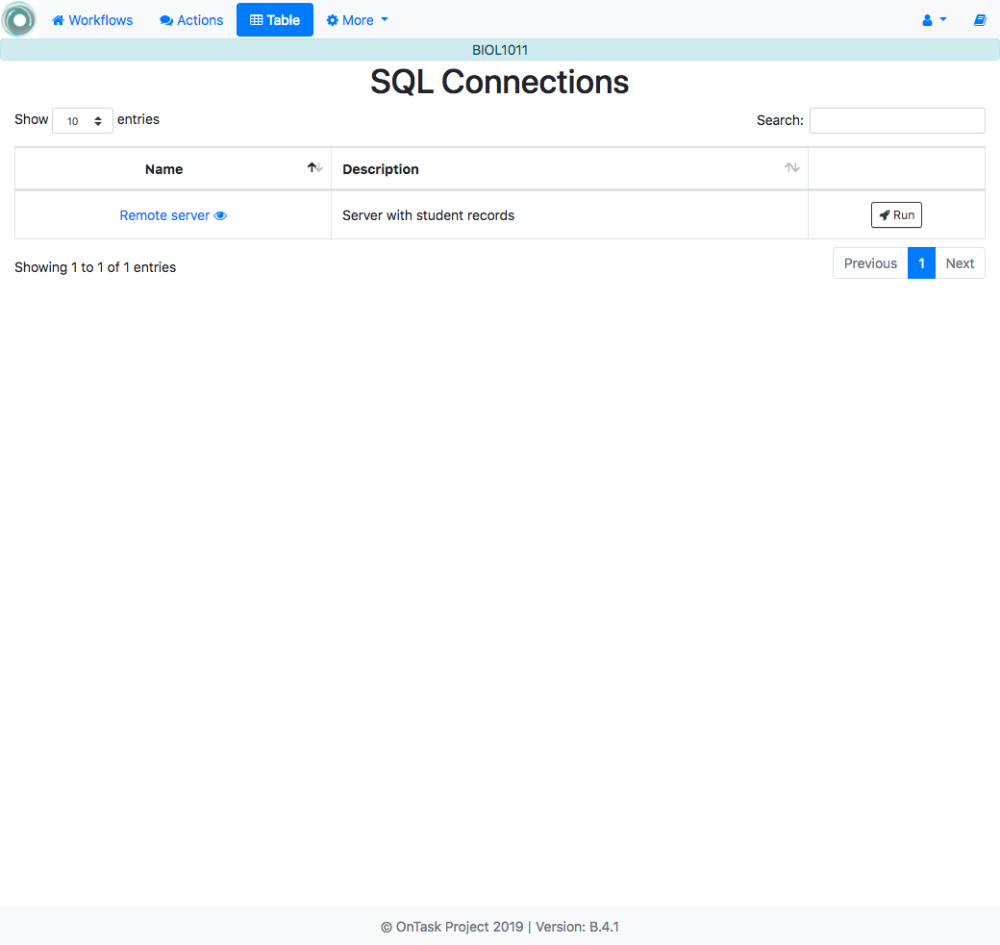

When *running* a SQL connection the platform shows the configuration parameters and request the password to access the remote database (if required).

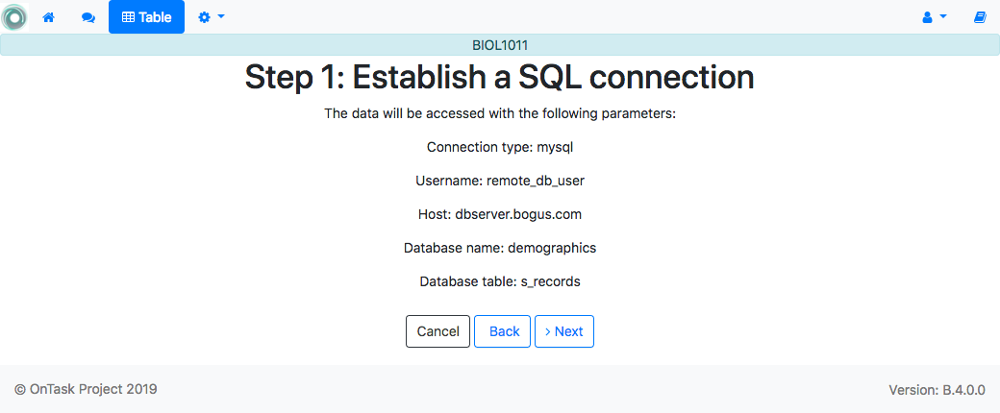

Data Upload
===========

The operations described in the previous section obtain a data set and, if the workflow table is empty, it sets its initial content. In Step 2 of the process, OnTask offers the possibility of selecting and renaming the columns before they are uploaded to the table. For each column detected in the file, the table includes if it has been detected to be unique, its automatically detected type, a box to select, the name, and an alternative name (to allow column renaming). This step is to allow you to select those columns that are relevant and discard the rest. The platform requires you to choose **at least** one column with unique values.

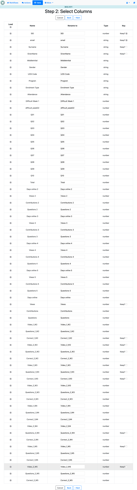

After this step is performed, the data is stored in the table and the platform shows the :ref:`details` page. If these operations are done with a workflow that already has data in the table, then two additional steps are required as part of the *merge* operation.

Data Merge
==========

.. sidebar:: Merge a.k.a "Join"

   Merging is quite common in databases and is known as a *join* operation. There are several variants of join operations depending how the differences between the key columns are handled. These same variants exist when combining columns in data frames (or a table).

A merge operation is needed when you want to *merge* a set of columns with an **already existing table**. This operation is very common in data science contexts. One of the problems is to specify how the values in the columns are *matched* with respect to the ones already existing in the table. In other words, each new column has a set of values, but they need to be in the right order so that the information is matched appropriately for every row. The solution for this problem is to include in both the existing table and the new data being merged a **unique or key column**. These columns have the property that unique distinguish each row with a value and therefore they are used to make sure that rows with matching values in these columns are merged. When uploading new data in a workflow that already contains data in its table, the platform automatically detects it and executes two additional steps to complete a *merge* operation.

The next step is the most delicate one. It requires you to identify the unique columns in both the existing data table and the one being uploaded, the criteria to merge the rows. We discuss each of these parameters in more detail.

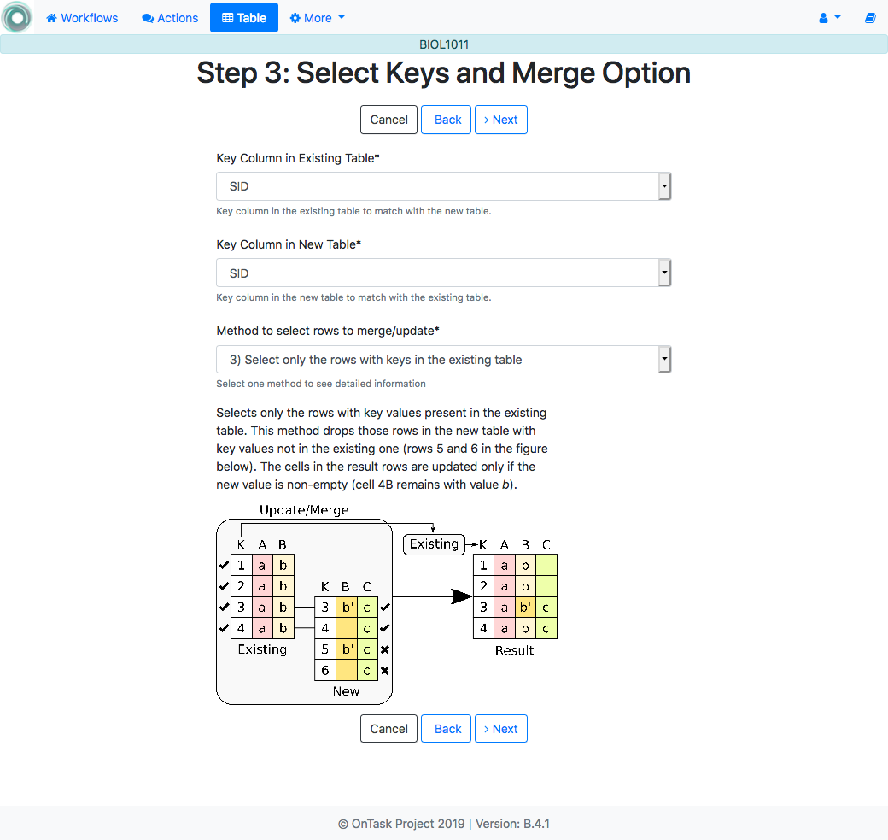

Key columns
  You have to select a key column present in the data to be merged (mandatory) and a key column from the existing data (mandatory).

Merge method
  There are four types of merging. Once you choose an option an explanation appears below.

  Select only the rows with keys in both existing and new table
    It will process only the rows for which values in both key columns are present. Or in other words, any row for which there is no value in either of the key columns **will be dropped**.

    .. figure:: ../../src/media/merge_inner.png
       :align: center

  Select all rows in both the existing and new table
    All rows in both tables will be considered. You have to be careful with this option because it may produce columns that are no longer unique as a result.

    .. figure:: ../../src/media/merge_outer.png
       :align: center

  Select the rows with keys in the existing table
    Only the rows with a value in the existing table will be considered, the rest will be dropped.

    .. figure:: ../../src/media/merge_left.png
       :align: center

  Select the rows with keys in the new table
    Only the rows with a value in the table being uploaded will be considered, the rest will be dropped.

    .. figure:: ../../src/media/merge_right.png
       :align: center

In any of these variants, for those columns that are present in both the existing table and the new table, the values of the second will update the existing ones. This updating operation may introduce non-values in some of the columns. You have to take extra care when performing this operation as it may destroy part of the existing data. In the extreme case, if you try to merge a table with a key column with no values in common with the existing key and you select the method that considers rows with keys in both the existing and new table, the result is an empty table.

After selecting these parameters the last step is to review the effect of the operation and proceed with the merge.

.. figure:: ../scaptures/dataops_upload_merge_step4.png
   :align: center

.. _table:

The Table
=========

   "You're here because you know something. What you know you can't explain,
   but you feel it"
   -- Morpheus, The Matrix

This functionality is basically to show the values stored in the workflow. Since this data can be arbitrarily large, it is likely that only a portion of the columns is shown on the screen at any given point.

.. figure:: ../scaptures/table.png
   :align: center
   :width: 100%

The rows shown in the screen grouped into
pages (you may choose the number of entries per page in the upper left side of the table) and allows to search for values. The icons in the left side of each row allow you to edit any of the values or delete a row entirely. If the *Add row* operation is selected a form with one field per column is shown. The values entered in this form will be checked to verify that the unique key property of the columns is preserved.

Due to the potential large size of this table in either number of rows or columns, OnTask offers the possibility to define *views*. A view is simply a set of columns selected to visualize, and optionally, a filter that selects a subset of rows.

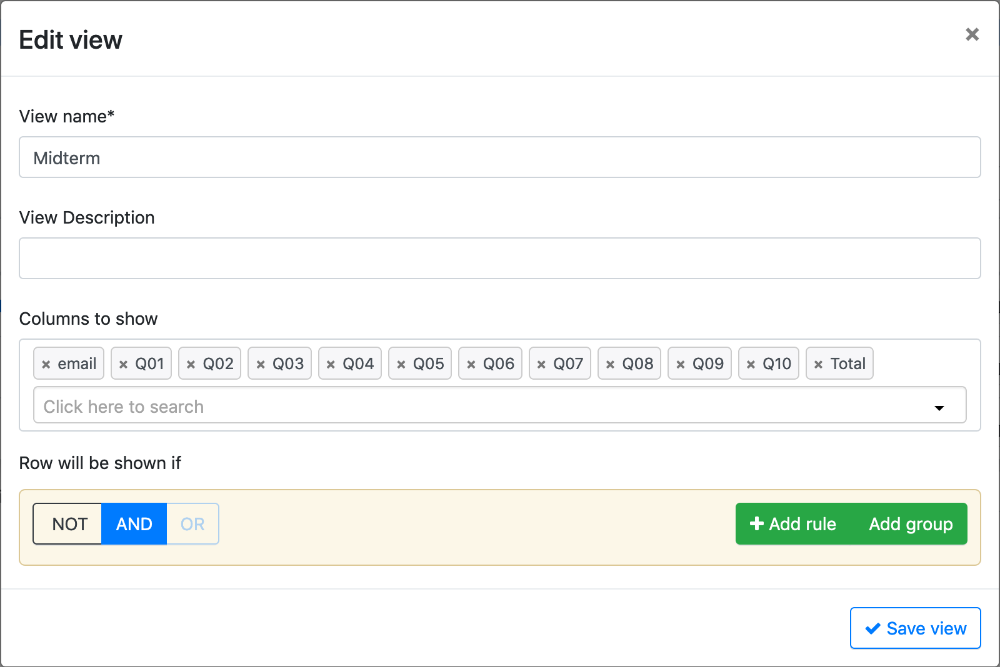

You may define several views for the workflow.

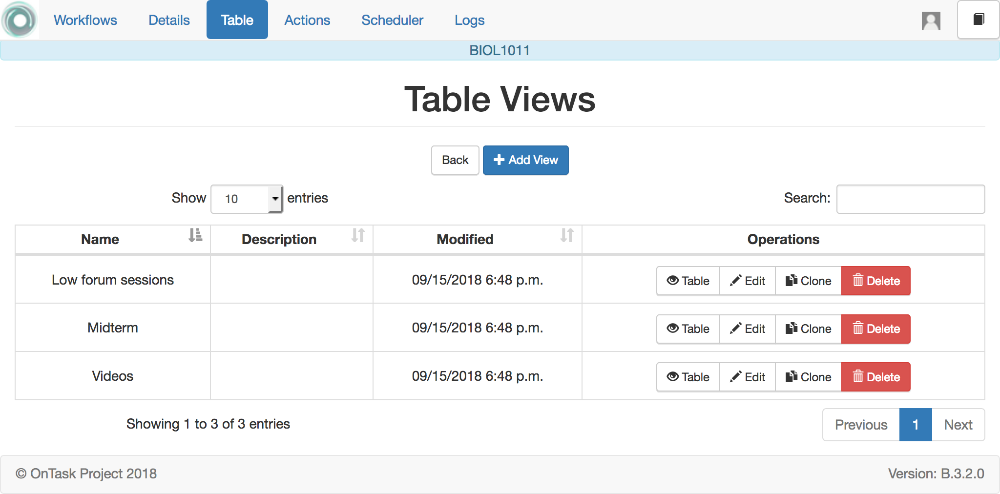

And select to see the table values corresponding to one view

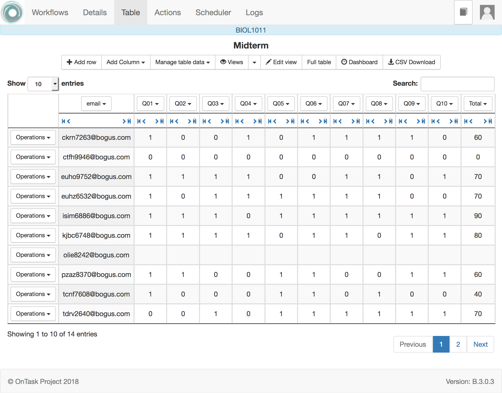

The same page also allows to download the content of the whole table in CSV format.

.. _action:

The Actions
===========

    "In order to carry a positive action we must develop here a positive
    vision"
    -- Dalai Lama

This is the most important functionality of the platform. Actions are exchange
of information with the learners. There are two types: actions in, and actions
out. A workflow contains an arbitrary number of these actions. The *action*
page shows a table with the actions in the selected workflow.

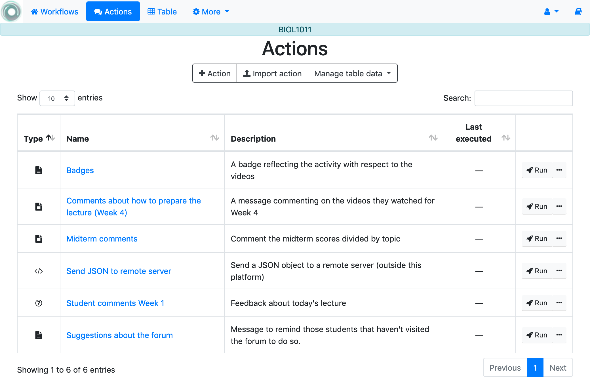

Similarly to the case of the workflow, each action is identified by a name
(unique) and an optional description. There are several operations supported
for each action (right most column in the table shown in the previous figure).

Actions In
----------

These actions allow you either instructors or students to introduce
information in the table stored in a workflow. When providing information, you
typically are interested in a subset of the rows (some of the learners) and a
subset of the columns. For example, an instructor may like to check if a group of students is attending a face-to-face session, or if a group of students is engaging in a project discussion.

These actions are edited using the screen shown in the following figure:

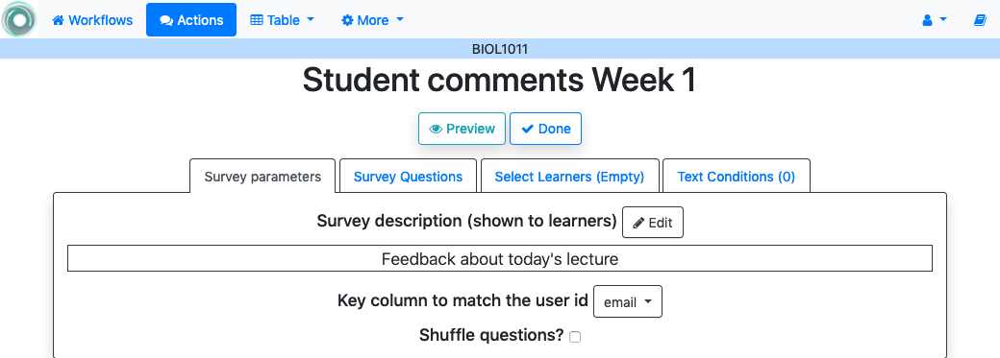

The page has several elements. From top to bottom, the first one is a filter to restrict the rows in the table considered for data entry. Those rows
that satisfy the condition are prepared for data entry. The second part of the
screen is a description that will be shown at the top of the page as a prelude for the fields to enter the data. The next section is they key column that will be used to match the data entry. The last section of the screen is a set of non-key columns to use to ask the questions. The *Preview* button at the bottom of the page shows the page that will be shown to the students.

Once an *Action In* has been selected, there are two operations available
represented by the buttons with labels *Run* and *URL*. The *Run* operation is
intended for the instructors to enter the data for a set of learners. After
clicking the link the platform shows a table with the data about the learners.
The table has a search box in the upper left corner to quickly find a person
as illustrated in the next figure.

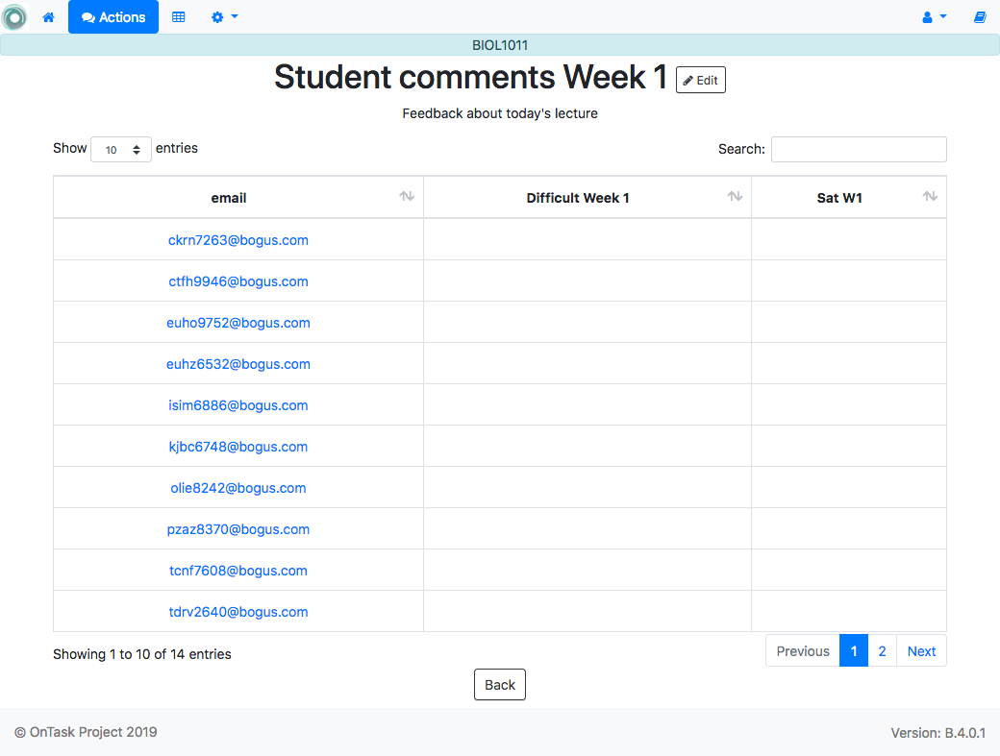

An instructor may click in the link available in the right column and it is
offered the possibility of modifying the information in the preselected
columns for that learner.

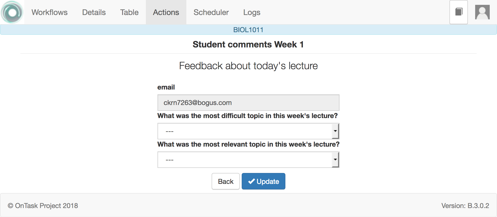

After entering the information the platform refreshes the list of students for
which the data entry is still allowed. The second operation available for
*Actions In* is to make available the URL to learners so that they
individually enter the information themselves. If you go back to the table
showing all the actions and click in the icon with label *URL* you are given
the choice to enable/disable a specific URL for the students to access the
data entry screen.

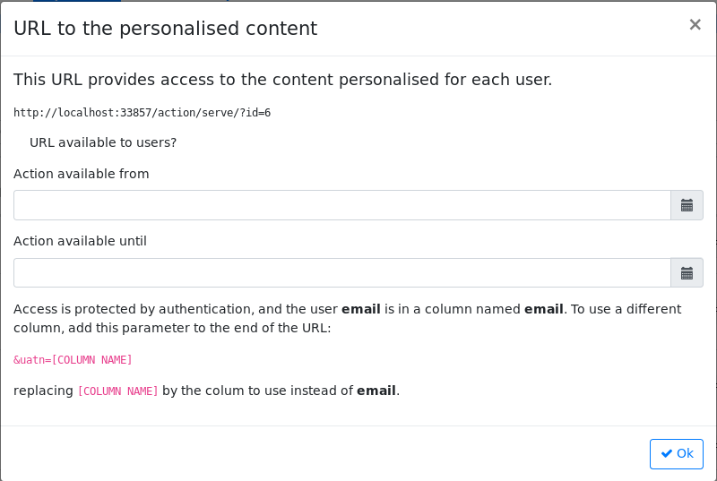

You then may send or make available this URL and, after authentication,
students will be able to enter the information requested and the values are
automatically stored in the right row and column in the table. These actions
offer an ideal procedure to collect information about any aspect of a course
in a way that is centralized and available for further processing. The power
of these actions is complemented when combined with *Actions Out*, in which
personalized content is made available to the learners.

Actions Out
-----------

These actions allow to create a resource (in a format close to HTML) and mark certain elements with conditions that will control its appearance in the final view. Think of these *actions out* as a resource (item, message, tip, comment) you would give learners during a experience. You may have several of these items prepared to be used at different points during the experience. The action is manipulated with the screen shown in the following figure

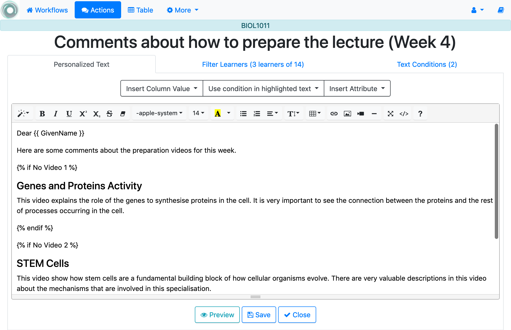

Before describing in detail the structure of this screen let's digress for a
second and explore the concept of *condition*. A condition in OnTask is  a
Boolean expression, or if you prefer, an expression that when evaluated will
return either **True** or **False**. These expressions are commonly used in
other applications such as spreadsheets or programming languages. The
following image shows an example of this condition.

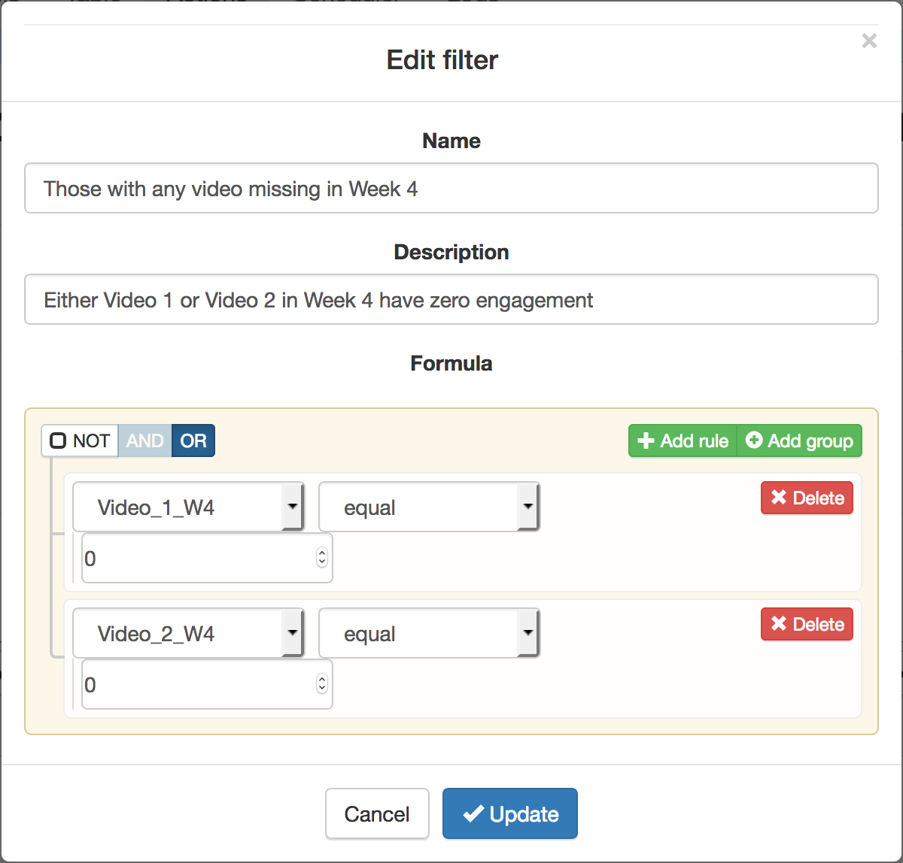

The Boolean expression is contained under the title **Formula**. The
expression can be alternatively read as::

  Days online = 0

The first element of the expression is the variable ``Days online_``. The
second element is the equal sign, and the third component is the constant
zero. The variable ``Days online`` may be replaced by any value in a
procedure we call *evaluation*. So, if the expression is evaluated replacing
the variable by the value 3, it results in :math:`3 = 0` which is false.
Alternatively, if we evaluate the expression replacing ``Days_online_2`` with
the value 0, then the expression becomes :math:`0 = 0`, which is trivially
true. With this structure, any expression then is evaluated by replacing the
variables by values and deciding if the resulting expression is true or false.

These conditions can have nested sub-expressions and get complex fairly quickly.
However, the underlying mechanism to evaluate them remains the same: replace
variables with values and decide the result (true or false). OnTask relies on
these expressions to personalize the content of the actions. Let's now go
back to the screen to edit an action. The area has four components

The filter
  The top area contains a *filter*. This element is an expression used to
  decide which table rows will be selected and used with this condition.

  .. figure:: ../scaptures/action_action_out_filterpart.png
     :align: center
     :width: 100%

  The name given to the expression is followed by how many table
  rows satisfy the filter condition (and therefore are selected). In
  practice, this is as if you dropped from the table some of the rows (it is
  just that they are ignored, not dropped.

The conditions
  This is the area immediately below the filter. Each condition allows you to
  edit its expression (first block with the pencil), use it in the text
  blow (block with the arrow), or delete it (trash can icon) as shown in the
  figure below

  .. figure:: ../scaptures/action_action_out_conditionpart.png
     :align: center
     :width: 100%

The HTML text
  This is the area to create the personalized document. It is a conventional
  HTML editor offering the usual functionalities (inserting text in
  various forms, headings, lists, links, images, etc.) Right above the editor
  window you have two choice menus that you can use to insert either a
  :ref:`workflow attribute <details_attributes>` or a column name that will
  be replaced by the corresponding value for each row.

  .. figure:: ../scaptures/action_action_out_editorpart.png
     :align: center
     :width: 100%

The preview/save buttons
  The *Save* button saves the content of the text editor, the *Save & Close*
  saves the content of the text editor and returns to the list of actions,
  and the *Preview* button shows how the text is rendered for every row in
  the table.

Using column values, attributes and conditions in an Action Out
^^^^^^^^^^^^^^^^^^^^^^^^^^^^^^^^^^^^^^^^^^^^^^^^^^^^^^^^^^^^^^^

The purpose of this page is to allow you to create a text in the editor that
may include three types of elements that are personalized for each row: an
attribute name, a column name or a condition.

To insert an attribute name simply place the cursor in the text editor in the
location where you want the value of that attribute to appear. Then, select
the attribute from the area above the editor and you will see how the name
of the attribute surrounded by double curly braces appears in the text (for
example ``{{ course_name }}``. Only :ref:`the attributes <details_attributes>`
you previously created in the details page are available.

To insert a column name, you follow the same steps but this time you select
one of the elements next to the text *Insert column value*. Place the cursor
in the location in which you want that value to appear, select the column
name from the pull-down menu, and the name appears in the text surrounded by
double curly braces (for example ``Hi {{ GivenName }}``.

These two elements will be included in the text with the corresponding values
(the same for all rows in the case of the attribute, and the value of the
corresponding row in the case of the column name. Inserting a condition is
different. Highlight the text in the editor and then click in the arrow of
one of the conditions. The text will be surrounded by two marks. For example
if the condition name is ``Video_active``, the text in the editor will appear
as:

  Good work with this week's video

This format states that the message *Good work with this week's video* should
appear only if the condition ``Video_active`` is true. If not, the text
should be ignored. The following figure illustrates this process.

  .. figure:: ../scaptures/OnTask___howtocreatetext.gif
     :align: center
     :width: 100%

Previewing the content of an Action Out
^^^^^^^^^^^^^^^^^^^^^^^^^^^^^^^^^^^^^^^

Once a text is created, you need to verify that all the elements are properly
visualized for each of the rows. This is the purpose of the ``Preview``
button at the bottom of the page.

  .. figure:: ../scaptures/OnTask___howtopreviewtext.gif
     :align: center
     :width: 100%

Sending personalized emails
^^^^^^^^^^^^^^^^^^^^^^^^^^^

You now have created an action and verified its content using the
*Preview* button. Go back to the *Actions* screen (showing the table with
the actions you created in the workflow). The right-most column shows a
button that reads *Email*.

.. figure:: ../scaptures/action_action_ops.png
   :align: center

This functionality process the text in the
action for each learner and sends the resulting text as an email. If you
click in that button the platform asks you for additional information:

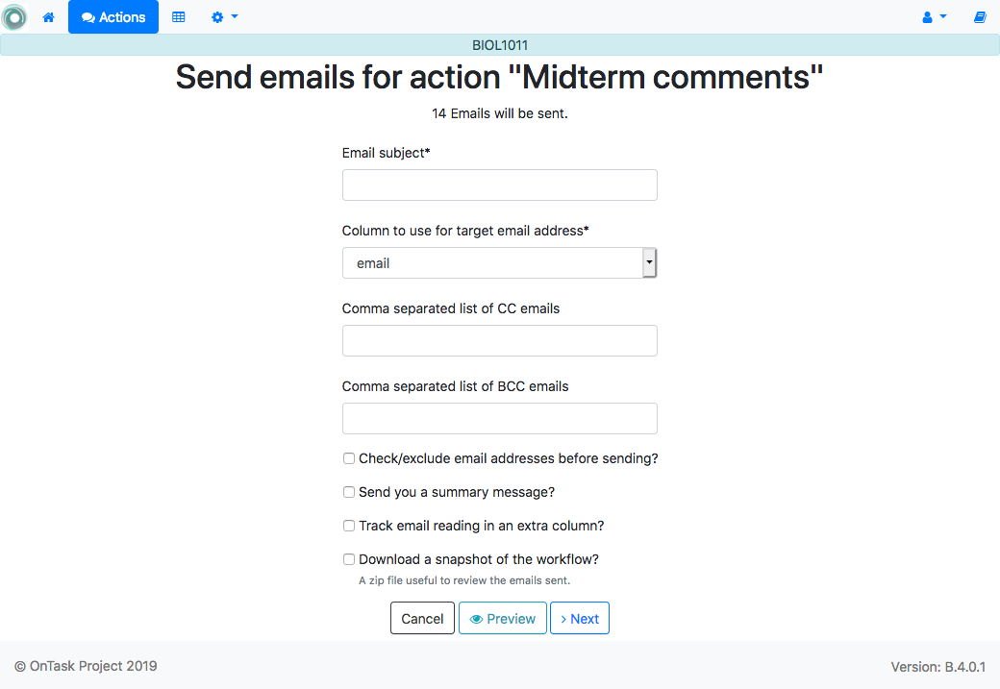

The subject
  A line to be included as subject of all the emails.

The column with the email address
  OnTask needs to know where to send the email. It assumes that you have a
  column containing that information for each learner and it needs you to
  select that column.

Send summary message
  If you select this option OnTask will send you an email with the summary of
  this operation (number of rows in the table that were selected by the
  filter, number of emails sent, date/time of the operation, etc.

Snapshot of the workflow
  If you select this option, after the emails are sent, the platform returns
  you a file that contains a snapshot (picture) of the workflow. It basically
  freezes the content of the workflow and places it in a file given to you.
  You may take this file and :ref:`import back the workflow <workflow_import>`.
  In this new workflow you can check the values and messages at the time the
  operation was executed.

Making personalized content available to learners
^^^^^^^^^^^^^^^^^^^^^^^^^^^^^^^^^^^^^^^^^^^^^^^^^

Sending a personalized email is just one of various possible actions to do
with a personalized text. Another one is to make the content available
through a URL that can then be given to the learners. OnTask offers this
possibility through the button labeled ``URL`` followed by either the word
``(Off)`` or ``(On)``.

.. figure:: ../scaptures/action_action_ops.png
   :align: center

If you select this option, the platform will show you the URL providing
access, the choice of making it available, and the possibility of using an
alternative column containing the email address.

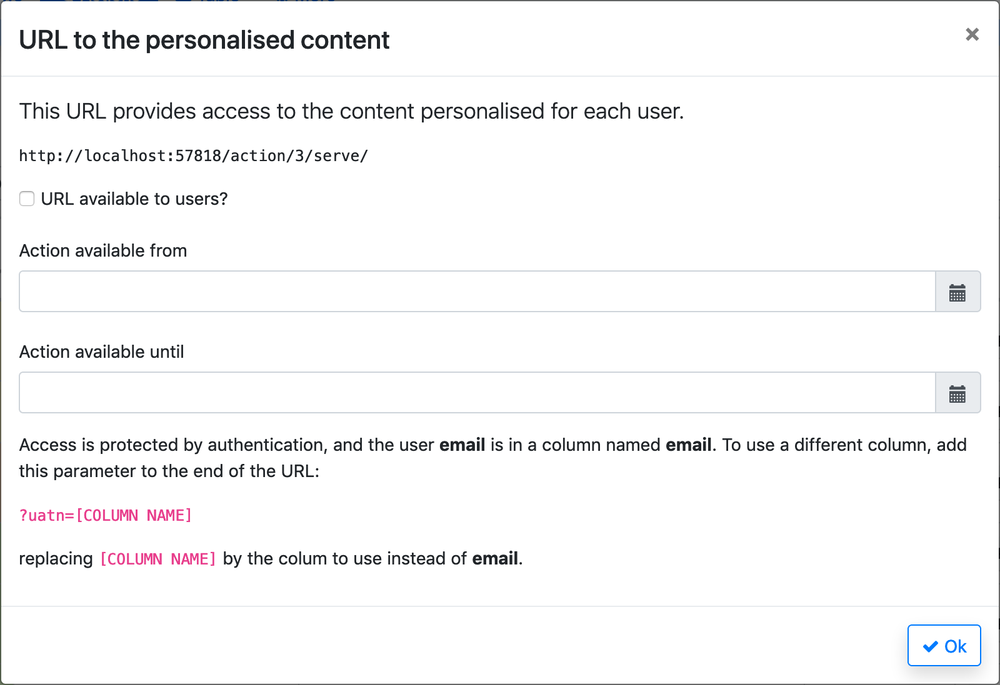

You may enable/disable this URL at any time. If a learner tries to access
this URL and it is disabled, the platform informs the user that the
information is not available.

.. _scheduler:

The Scheduler
=============

   "I have no regular schedule. I get up whenever I can."
   -- Jimmy Wales

The *actions out* that are used to send emails can be *scheduled* to
execute at some point in the future. The *Schedule* operation in these
actions opens a dialogue like the one shown in the following figure:

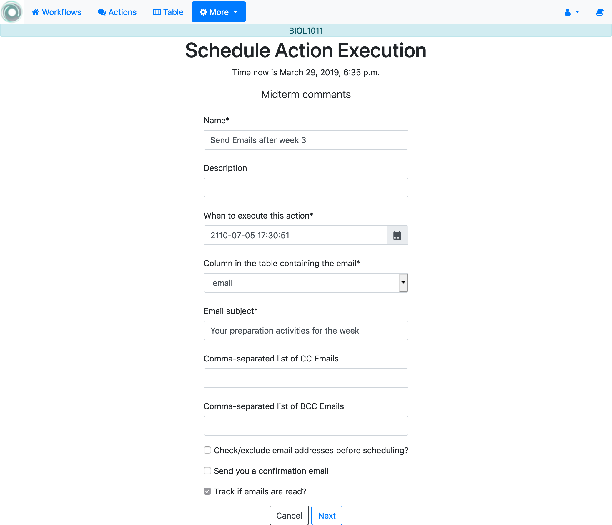

The action (sending the emails with the personalised text) is executed at the
selected time. This functionality requires the server to be configured to
check the list of pending tasks and execute them at the appropriate time (see
:ref:`scheduling_tasks`)

The *Schedule* item in the navigation menu shows all the scheduled tasks for
the current workflow. The left-most column offers the operations to edit the
task or delete it.

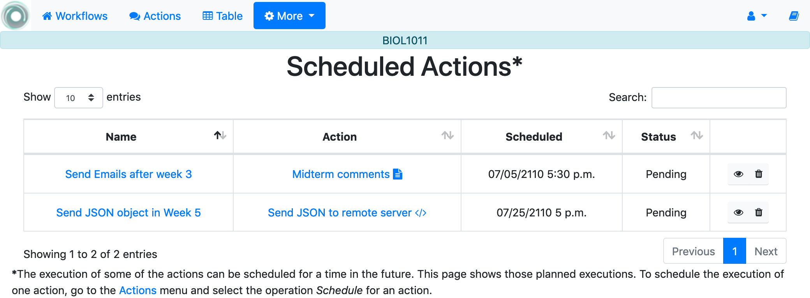

.. _logs:

The Logs
========

The platform keeps a log of most of the operations that are executed when
managing a workflow. These records are available through the *Logs* link in
the navigation bar at the top of the screen.

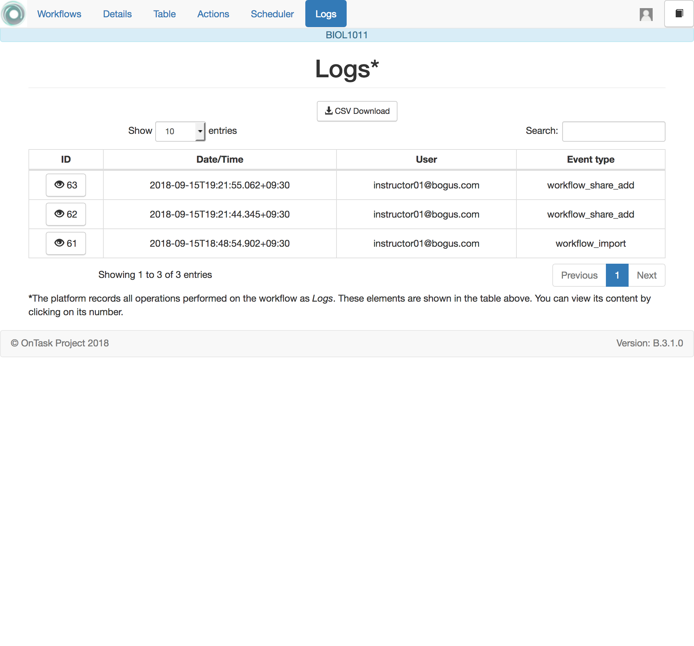

You may review the events and download them as a CSV file.

Plugins -- Transforming the data with your own code
===================================================

The additional method offered by OnTask to manipulate the data in a workflow's table is to execute arbitrary Python code encapsulated as a Python module and placed in a pre-defined folder in the computer hosting the server. In the context of the platform, these Python modules are called **Plugins** and require some :ref:`previous configuration <plugin_install>`. Before their execution, a plugin must be written and installed in the folder previously considered for that purpose.

The purpose of the plugins is to allow arbitrary transformations of the data attached to a workflow. The list of plugins available for execution can be accessed through the link *Transform* in the *Dataops* top menu item.

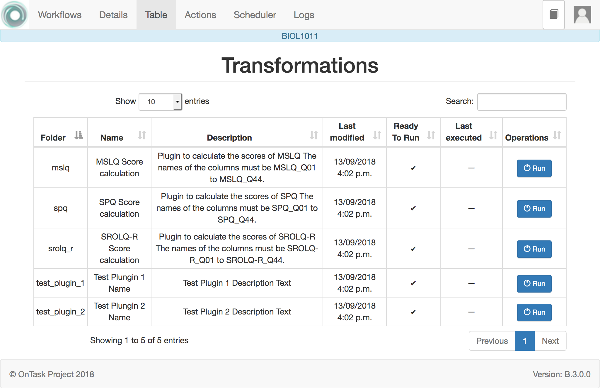

Each plugin is shown with a (unique) name, a description, the last time the code was modified (based on the file modification time), if the plugin is ready to execute, and the link for either the *Run* operation, or a link to the diagnostics if the execution is not possible.

The plugin execution request shows a form to collect the parameters required for the operation.

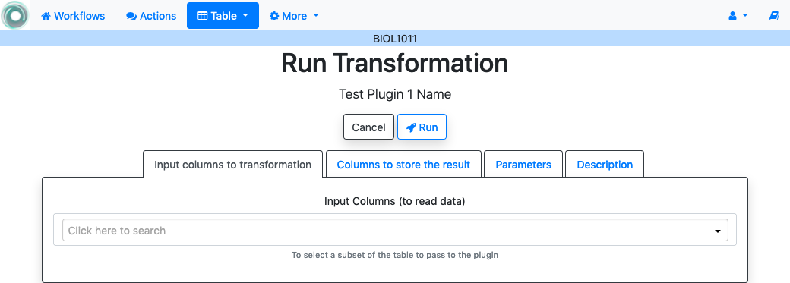

Input columns
  The columns from the data table that will be passed to the plugin. The plugin can define a set of *fixed* column names to extract. If this list is empty, the list is requested from the user.

Key column for merging
  The plugins are supposed to create additional columns, and they need to be merged with the existing data. For this procedure, a key-column is needed to make sure the rows of the newly created data are correctly stored. They key column from the current data frame is added as part of the input data frame passed to the plugin.

Output column names
  The plugins defines the names of the result columns. However, the upon execution, the user may rename any of those columns.

Suffix to add to the result columns
  This field is provided to do a one-place renaming. If given, this suffix is added to the names of all output columns.

Execution parameters
  This part of the form requests the pairs *(name, value)* as defined by the plugin.

After the appropriate data is provided the tool shows a plugin executing report showing the columns that will be created and how will they be merged with the existing data.

.. _plugin_requirements:

Plugin requirements
-------------------

The Python modules installed in the pre-defined folder need to satisfy various requirements to be considered for execution within OnTask. More precisely, the file ``__init__.py`` must contain:

1. Module variable ``class_name`` with the name of the class in the file that contains the required definitions.

1. Class field ``name`` with the plugin name to show to the users.

2. Class field ``escription_txt`` with a string with the detailed description of what the
   plugin does

3. Class field ``input_column_names`` with a potentially empty list of column names
(strings). If the list is empty, the columns are selected by the user at
execution time.

4. Class field ``output_column_names`` with a non empty list of names (strings) of the
columns to be used for the output of the transformation.

5. Class field ``parameters`` with an optionally empty list with tuples with the following
structure:

   ``('name', type, [list of allowed values], initial value, help_text)``

   These elements will be requested from the user before executing the
   plugin through a form. The conditions on these values are:

   - name must be a string

   - type must be a string equal to "integer", "double", "string",
     "datetime" or "boolean".

   - The list of values is to restrict the
     possible values

   - The initial value must be of the type specified by the second
     element.

   - Help_text a string to show as help text

6. Class method ``run`` that receives:

   - a pandas data frame with the data to process

   - a string with the name of the key column that will be used to merge
     the result.
   - A dictionary of pairs (name, value) with the parameters described in
     the previous element.

   an d returns a result Pandas data frame. This frame **must** have one
   column with the key column name provided so that it can be properly
   merged with the existing data.

If a plugin does not comply with these properties the platform shows a summary of these checks to diagnose the problem.

.. figure:: ../scaptures/dataops_plugin_diagnostics.png
   :align: center

