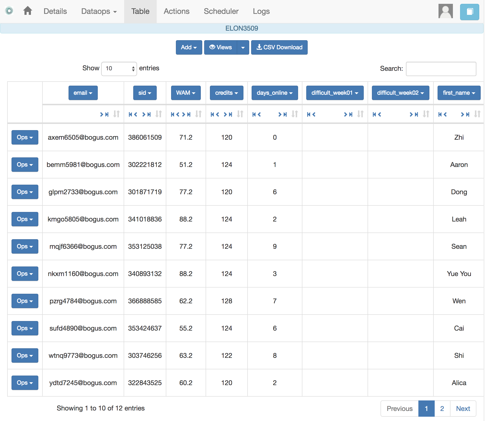
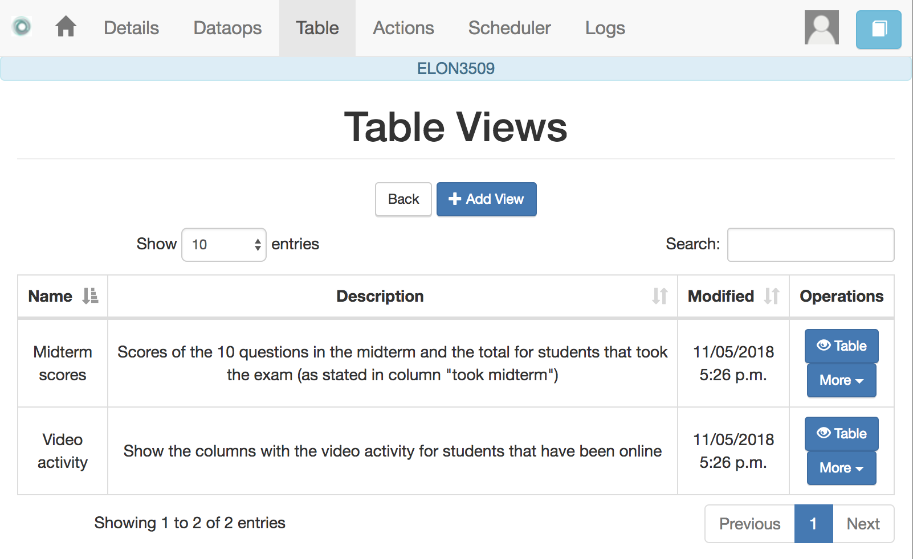
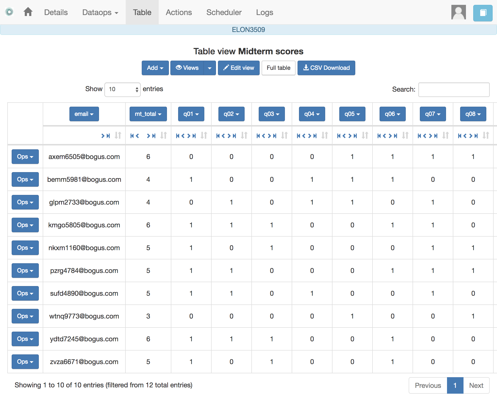

.. _table:

The Table
=========

   "You're here because you know something. What you know you can't explain,
   but you feel it"
   -- Morpheus, The Matrix

This functionality is basically to show the values stored in the workflow. Since this data can be arbitrarily large, it is likely that only a portion of the columns is shown on the screen at any given point.

The rows shown in the screen grouped into
pages (you may choose the number of entries per page in the upper left side of the table) and allows to search for values. The icons in the left side of each row allow you to edit any of the values or delete a row entirely. If the *Add row* operation is selected a form with one field per column is shown. The values entered in this form will be checked to verify that the unique key property of the columns is preserved.

Due to the potential large size of this table in either number of rows or columns, OnTask offers the possibility to define *views*. A view is simply a set of columns selected to visualize, and optionally, a filter that selects a subset of rows.

.. figure:: images/OnTask____View_edit.png
   :align: center
   :width: 100%

You may define several views for the workflow.

And select to see the table values corresponding to one view

The same page also allows to download the content of the whole table in CSV format.

